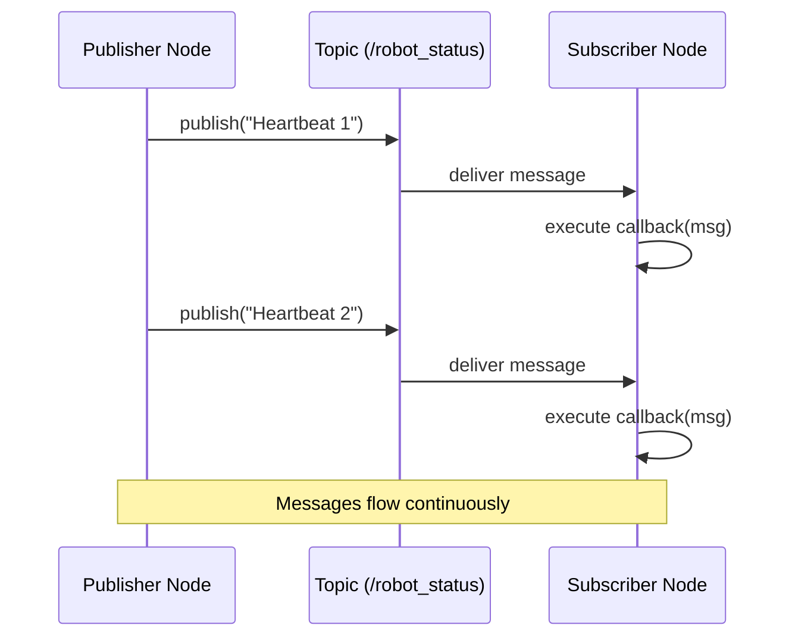
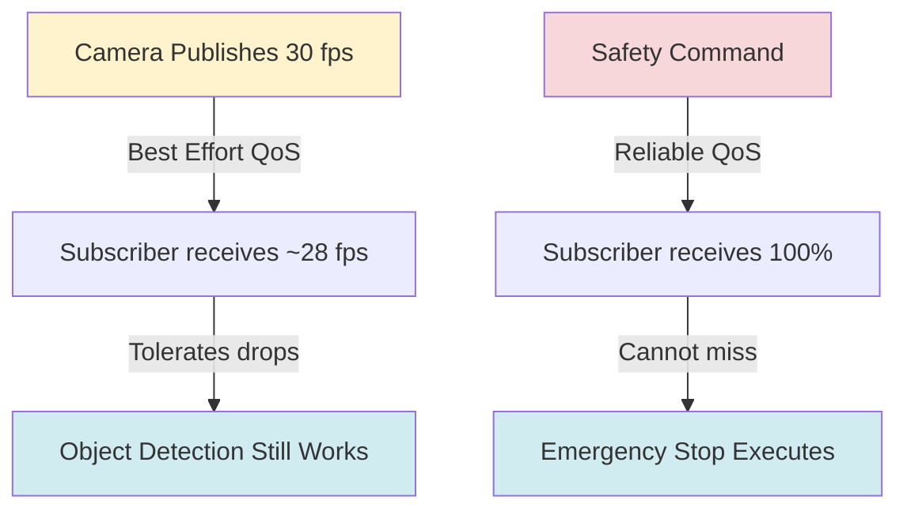

# The Robotic Nervous System: ROS 2 Fundamentals

> **Module**: 1 | **Estimated Reading Time**: 20 minutes

## Learning Objectives

By the end of this chapter, you will be able to:

- Explain what ROS 2 is and why it serves as the "nervous system" for modern robots
- Understand the publisher-subscriber communication pattern and when to use it
- Create functional ROS 2 nodes that exchange data between robot components
- Visualize ROS 2 system architecture using computational graphs
- Run ROS 2 applications on free-tier, CPU-only infrastructure

## Prerequisites

Before starting this chapter, ensure you have:

- Intermediate Python programming knowledge (functions, classes, imports)
- Linux command line familiarity (navigation, running scripts)
- Understanding of distributed systems concepts (optional but helpful)

---

## Introduction

Modern robots are not single programs. They are distributed systems with many components running at once: cameras capture images, sensors measure distance, motors execute movements, and AI models make decisions. How do these parts communicate? Enter ROS 2 (Robot Operating System 2) — the framework that serves as a robot's nervous system.

ROS 2 provides a standard way for robot components to exchange data in real-time. Like your nervous system sends signals between your brain and muscles, ROS 2 connects robot "brains" (control algorithms) with actuators and sensors. This design lets engineers develop, test, and swap components independently.

Unlike ROS 1, ROS 2 was built for production robotics with better security, real-time performance, and cross-platform support. Companies like BMW, Bosch, and NASA use ROS 2 because it solves distributed robot communication.

### Key Questions This Chapter Answers

- Why do robots need a communication framework like ROS 2?
- How does the publisher-subscriber pattern enable modular robot design?
- What makes ROS 2 suitable for real-time, safety-critical applications?

---

## Section 1: ROS 2 Core Concepts

ROS 2 organizes robot software into **nodes** — independent processes that do specific tasks. A camera node captures images, a planning node computes paths, and a motor node moves the robot. Nodes talk through **topics**, which are named channels for data. This is called **publish-subscribe messaging**.

Here's how it works: a node that makes data (like a camera) *publishes* messages to a topic. Other nodes that need that data *subscribe* to the same topic. ROS 2 handles message delivery automatically, even across different computers. This means you can swap a physical camera with a simulated one — subscribers don't know the difference.

ROS 2 also has **services** for request-response (like asking battery level) and **actions** for long tasks (like "go to waypoint"). But topics are most common for continuous data like sensor readings.

### Mermaid Diagram: ROS 2 Node Communication Architecture

```mermaid
graph LR
    A[Camera Node] -->|publishes| B[/camera/image Topic]
    B -->|subscribes| C[Object Detection Node]
    C -->|publishes| D[/detected_objects Topic]
    D -->|subscribes| E[Motion Planning Node]
    E -->|publishes| F[/cmd_vel Topic]
    F -->|subscribes| G[Motor Controller Node]

    style B fill:#e1f5ff
    style D fill:#e1f5ff
    style F fill:#e1f5ff
```

**Diagram Explanation**: This flowchart shows how data flows through a typical robot vision pipeline. The Camera Node publishes images to a topic. The Object Detection Node subscribes to that topic, processes images, and publishes detected objects. This chain continues until motor commands reach the Motor Controller Node. Topics (shown in blue) act as data highways connecting nodes.

### Code Example: Creating a Simple ROS 2 Publisher

```python
# minimal_publisher.py - Publishes robot status messages every second
import rclpy
from rclpy.node import Node
from std_msgs.msg import String

class MinimalPublisher(Node):
    """A basic ROS 2 publisher that sends status updates"""

    def __init__(self):
        super().__init__('minimal_publisher')
        # Create publisher for 'robot_status' topic, queue size 10
        self.publisher_ = self.create_publisher(String, 'robot_status', 10)
        # Timer triggers callback every 1.0 seconds
        self.timer = self.create_timer(1.0, self.timer_callback)
        self.counter = 0

    def timer_callback(self):
        """Publishes a status message with incrementing counter"""
        msg = String()
        msg.data = f'Robot operational: heartbeat {self.counter}'
        self.publisher_.publish(msg)
        self.get_logger().info(f'Publishing: "{msg.data}"')
        self.counter += 1

def main(args=None):
    rclpy.init(args=args)
    publisher = MinimalPublisher()
    rclpy.spin(publisher)  # Keep node running
    publisher.destroy_node()
    rclpy.shutdown()

if __name__ == '__main__':
    main()
```

**What this code does**: Creates a ROS 2 node that publishes a "heartbeat" message every second to the `robot_status` topic. This pattern is common for system health monitoring.

**Dependencies**: `pip install rclpy` (ROS 2 Python client library — install from ROS 2 Humble binaries)

**Expected output**:
```
[INFO] [minimal_publisher]: Publishing: "Robot operational: heartbeat 0"
[INFO] [minimal_publisher]: Publishing: "Robot operational: heartbeat 1"
[INFO] [minimal_publisher]: Publishing: "Robot operational: heartbeat 2"
```

**Free-Tier Note**: ✅ This example runs CPU-only on any Linux machine with ROS 2 Humble installed (available free from apt packages).

---

## Section 2: Building a Subscriber Node

Now that we have a publisher sending messages, we need a subscriber to receive them. Subscribers "listen" to topics and execute callback functions whenever new messages arrive. This reactive programming model is ideal for robots that must respond to sensor data in real-time.

In ROS 2, you define a callback function that processes each incoming message. The ROS 2 executor handles threading and message delivery, so you focus on your robot's logic rather than network programming. This abstraction is why ROS 2 accelerates development — you're not writing TCP socket code to communicate between processes.

### Mermaid Diagram: Publisher-Subscriber Interaction Sequence



**Diagram Explanation**: This sequence diagram shows the timeline of message exchanges. The Publisher Node sends messages to the Topic, which immediately delivers them to any Subscriber Nodes. Each delivery triggers the subscriber's callback function to process the message.

### Code Example: Creating a Simple ROS 2 Subscriber

```python
# minimal_subscriber.py - Receives and logs robot status messages
import rclpy
from rclpy.node import Node
from std_msgs.msg import String

class MinimalSubscriber(Node):
    """A basic ROS 2 subscriber that listens to status updates"""

    def __init__(self):
        super().__init__('minimal_subscriber')
        # Create subscription to 'robot_status' topic
        self.subscription = self.create_subscription(
            String,
            'robot_status',
            self.listener_callback,
            10)  # Queue size for message buffering

    def listener_callback(self, msg):
        """Called automatically when new message arrives"""
        self.get_logger().info(f'Received: "{msg.data}"')

def main(args=None):
    rclpy.init(args=args)
    subscriber = MinimalSubscriber()
    rclpy.spin(subscriber)  # Keep node running
    subscriber.destroy_node()
    rclpy.shutdown()

if __name__ == '__main__':
    main()
```

**What this code does**: Creates a ROS 2 node that subscribes to the `robot_status` topic and prints each received message. Run this alongside the publisher to see communication in action.

**Dependencies**: `pip install rclpy`

**Expected output**:
```
[INFO] [minimal_subscriber]: Received: "Robot operational: heartbeat 0"
[INFO] [minimal_subscriber]: Received: "Robot operational: heartbeat 1"
[INFO] [minimal_subscriber]: Received: "Robot operational: heartbeat 2"
```

**Free-Tier Note**: ✅ CPU-only execution, no GPU or paid services required.

---

## Section 3: Quality of Service (QoS) and Reliable Communication

Real-world robot communication faces challenges: network delays, packet loss, and bandwidth constraints. ROS 2 addresses these with **Quality of Service (QoS) policies** — configurations that control how messages are delivered. You can tune reliability, message history depth, and durability based on your application's needs.

For example, sensor data like camera images may tolerate occasional dropped frames (use "best effort" reliability), while safety-critical commands must be guaranteed delivery ("reliable" policy). ROS 2 lets you configure QoS per-topic, optimizing performance without sacrificing safety.

The most common QoS settings are:
- **Reliability**: Best Effort (fast, may drop messages) vs. Reliable (guaranteed delivery, slower)
- **History**: Keep Last (store only N recent messages) vs. Keep All (store everything until processed)
- **Durability**: Volatile (no persistence) vs. Transient Local (new subscribers get last message)

### Mermaid Diagram: QoS Policy Impact on Message Delivery



**Diagram Explanation**: This diagram contrasts two QoS strategies. Camera image streams use Best Effort QoS, accepting minor frame drops for speed. Safety commands use Reliable QoS, ensuring every message arrives even if it takes longer. Different applications require different trade-offs.

### Code Example: Configuring QoS for Reliable Communication

```python
# reliable_publisher.py - Publisher with custom QoS for critical messages
import rclpy
from rclpy.node import Node
from rclpy.qos import QoSProfile, ReliabilityPolicy, HistoryPolicy
from std_msgs.msg import String

class ReliablePublisher(Node):
    """Publisher configured for guaranteed message delivery"""

    def __init__(self):
        super().__init__('reliable_publisher')

        # Configure QoS for reliable, safety-critical communication
        qos_profile = QoSProfile(
            reliability=ReliabilityPolicy.RELIABLE,  # Guarantee delivery
            history=HistoryPolicy.KEEP_LAST,
            depth=10
        )

        self.publisher_ = self.create_publisher(
            String,
            'emergency_stop',
            qos_profile
        )
        self.timer = self.create_timer(5.0, self.timer_callback)

    def timer_callback(self):
        """Publishes critical safety command"""
        msg = String()
        msg.data = 'EMERGENCY_STOP_ACTIVATED'
        self.publisher_.publish(msg)
        self.get_logger().info('Safety command sent with reliable QoS')

def main(args=None):
    rclpy.init(args=args)
    publisher = ReliablePublisher()
    rclpy.spin(publisher)
    publisher.destroy_node()
    rclpy.shutdown()

if __name__ == '__main__':
    main()
```

**What this code does**: Demonstrates how to configure QoS policies for reliable message delivery. This pattern is essential for safety-critical robot commands where message loss is unacceptable.

**Dependencies**: `pip install rclpy`

**Expected output**:
```
[INFO] [reliable_publisher]: Safety command sent with reliable QoS
```

**Free-Tier Note**: ✅ CPU-only execution.

---

## Section 4: ROS 2 Computational Graph and Discovery

One of ROS 2's most powerful features is **automatic node discovery**. When you launch nodes on the same network, they automatically find each other without manual configuration. This works through DDS (Data Distribution Service), the middleware that ROS 2 uses for communication.

You can visualize your running system as a **computational graph** where nodes are vertices and topics are edges. ROS 2 provides command-line tools to inspect this graph in real-time, helping you debug communication issues and understand data flow.

### Mermaid Diagram: ROS 2 Computational Graph Example

```mermaid
graph TB
    subgraph Robot System
        A[/camera/image]
        B[/detected_objects]
        C[/robot_pose]
        D[/cmd_vel]
    end

    N1[camera_driver] --> A
    A --> N2[object_detector]
    N2 --> B
    B --> N3[planner]
    N4[localizer] --> C
    C --> N3
    N3 --> D
    D --> N5[motor_controller]

    style A fill:#e1f5ff
    style B fill:#e1f5ff
    style C fill:#e1f5ff
    style D fill:#e1f5ff
```

**Diagram Explanation**: This computational graph shows a complete robot system. Nodes (rectangles) publish and subscribe to topics (blue ovals). Multiple nodes can publish to or subscribe from the same topic, creating complex data flow patterns. Tools like `ros2 node list` and `ros2 topic echo` let you inspect this graph while the system runs.

### Code Example: Inspecting the ROS 2 Graph with CLI Tools

```python
# graph_inspector.py - Programmatically inspect ROS 2 system
import rclpy
from rclpy.node import Node

class GraphInspector(Node):
    """Node that queries and displays the ROS 2 computational graph"""

    def __init__(self):
        super().__init__('graph_inspector')
        self.timer = self.create_timer(5.0, self.inspect_graph)

    def inspect_graph(self):
        """Query and log active nodes and topics"""
        # Get list of all active nodes
        node_names = self.get_node_names()
        self.get_logger().info(f'Active nodes: {len(node_names)}')

        # Get list of all active topics
        topic_list = self.get_topic_names_and_types()
        self.get_logger().info(f'Active topics: {len(topic_list)}')

        # Log details
        for node in node_names:
            self.get_logger().info(f'  - Node: {node}')
        for topic, types in topic_list:
            self.get_logger().info(f'  - Topic: {topic} (types: {types})')

def main(args=None):
    rclpy.init(args=args)
    inspector = GraphInspector()
    rclpy.spin(inspector)
    inspector.destroy_node()
    rclpy.shutdown()

if __name__ == '__main__':
    main()
```

**What this code does**: Creates a node that periodically queries the ROS 2 graph to list all active nodes and topics. This is useful for system monitoring and debugging.

**Dependencies**: `pip install rclpy`

**Expected output**:
```
[INFO] [graph_inspector]: Active nodes: 3
[INFO] [graph_inspector]: Active topics: 2
[INFO] [graph_inspector]:   - Node: /minimal_publisher
[INFO] [graph_inspector]:   - Node: /minimal_subscriber
[INFO] [graph_inspector]:   - Topic: /robot_status (types: ['std_msgs/msg/String'])
```

**Free-Tier Note**: ✅ CPU-only execution.

---

## Section 5: Practical Application — Building a Robot Health Monitor

Let's combine publisher-subscriber patterns and QoS policies to build a practical robot health monitoring system. This application demonstrates how ROS 2 components work together in real-world scenarios.

### Complete Example: Multi-Node Health Monitoring System

```python
# health_monitor.py - Complete system with multiple publishers and aggregator
import rclpy
from rclpy.node import Node
from std_msgs.msg import String
import json

class SensorHealthPublisher(Node):
    """Simulates a sensor reporting its health status"""

    def __init__(self, sensor_name):
        super().__init__(f'{sensor_name}_health')
        self.publisher_ = self.create_publisher(String, 'sensor_health', 10)
        self.timer = self.create_timer(2.0, self.publish_health)
        self.sensor_name = sensor_name

    def publish_health(self):
        """Publishes sensor health data as JSON"""
        health_data = {
            'sensor': self.sensor_name,
            'status': 'operational',
            'temperature': 45,  # Celsius
            'uptime': 3600  # seconds
        }
        msg = String()
        msg.data = json.dumps(health_data)
        self.publisher_.publish(msg)
        self.get_logger().info(f'{self.sensor_name} health published')

class HealthAggregator(Node):
    """Subscribes to all sensor health reports and aggregates status"""

    def __init__(self):
        super().__init__('health_aggregator')
        self.subscription = self.create_subscription(
            String,
            'sensor_health',
            self.health_callback,
            10)
        self.sensor_status = {}

    def health_callback(self, msg):
        """Processes incoming health reports"""
        data = json.loads(msg.data)
        self.sensor_status[data['sensor']] = data['status']

        # Log aggregated status
        healthy = sum(1 for s in self.sensor_status.values() if s == 'operational')
        total = len(self.sensor_status)
        self.get_logger().info(
            f'System Health: {healthy}/{total} sensors operational'
        )

def main(args=None):
    rclpy.init(args=args)

    # Create multiple sensor publishers
    camera_health = SensorHealthPublisher('camera')
    lidar_health = SensorHealthPublisher('lidar')
    imu_health = SensorHealthPublisher('imu')

    # Create health aggregator
    aggregator = HealthAggregator()

    # Run all nodes concurrently
    executor = rclpy.executors.MultiThreadedExecutor()
    executor.add_node(camera_health)
    executor.add_node(lidar_health)
    executor.add_node(imu_health)
    executor.add_node(aggregator)

    try:
        executor.spin()
    finally:
        executor.shutdown()
        camera_health.destroy_node()
        lidar_health.destroy_node()
        imu_health.destroy_node()
        aggregator.destroy_node()
        rclpy.shutdown()

if __name__ == '__main__':
    main()
```

**What this code does**: Creates a complete health monitoring system with three sensor nodes publishing status updates and one aggregator node tracking overall system health. This demonstrates multi-node architectures and JSON message passing — both common in production robots.

**Dependencies**: `pip install rclpy`

**How to run**:
```bash
python health_monitor.py
```

**Expected output**:
```
[INFO] [camera_health]: camera health published
[INFO] [lidar_health]: lidar health published
[INFO] [imu_health]: imu health published
[INFO] [health_aggregator]: System Health: 3/3 sensors operational
```

**Free-Tier Note**: ✅ CPU-only execution, no external dependencies.

---

## Common Pitfalls & Troubleshooting

### Issue 1: "Cannot find package 'rclpy'" Error

**Solution**: Ensure ROS 2 Humble is installed and sourced correctly:
```bash
sudo apt update
sudo apt install ros-humble-rclpy
source /opt/ros/humble/setup.bash
```
Add the source command to your `~/.bashrc` to make it permanent.

### Issue 2: Subscriber Not Receiving Messages

**Solution**: Check that publisher and subscriber use the same topic name and message type. Verify with:
```bash
ros2 topic list  # Should show your topic
ros2 topic info /your_topic  # Check publisher/subscriber count
```

### Issue 3: "DDS Domain Mismatch" Warning

**Solution**: ROS 2 nodes must be on the same DDS domain to communicate. Set explicitly:
```bash
export ROS_DOMAIN_ID=0  # Use consistent ID across all terminals
```

---

## Summary

ROS 2 serves as the nervous system of modern robots, providing a standardized framework for distributed component communication. By using publish-subscribe patterns, you can build modular robot systems where sensors, algorithms, and actuators operate independently yet coordinate seamlessly.

The key to mastering ROS 2 is understanding its core abstractions: nodes encapsulate functionality, topics enable data flow, and QoS policies tune communication behavior. These building blocks scale from simple two-node systems to complex autonomous vehicles with hundreds of components.

As you progress through this textbook, every robotics concept builds on ROS 2 foundations. Digital twins simulate ROS 2 systems, NVIDIA Isaac processes ROS 2 sensor data, and VLA systems issue commands through ROS 2 topics. Mastering this chapter unlocks the entire Physical AI stack.

**Key Takeaways**:
- ROS 2 enables distributed robot components to communicate through publish-subscribe messaging
- Nodes are independent processes; topics are named channels for data exchange
- QoS policies let you tune message delivery for different application requirements
- Automatic discovery means nodes find each other without manual network configuration
- The computational graph provides a visual model of your robot's communication architecture

---

## References

Official documentation sources used in this chapter:

- [ROS 2 Humble Documentation](https://docs.ros.org/en/humble/) - Official ROS 2 Humble Hawksbill documentation
- [ROS 2 Design Decisions](https://design.ros2.org/) - Architectural rationale and design principles
- [rclpy API Reference](https://docs.ros2.org/latest/api/rclpy/) - Python client library documentation
- [ROS 2 QoS Policies](https://docs.ros.org/en/humble/Concepts/About-Quality-of-Service-Settings.html) - Quality of Service configuration guide
- [DDS Specification](https://www.omg.org/spec/DDS/) - Data Distribution Service standard (underlying middleware)

---

## Next Steps

**Continue your learning journey**:

→ [Digital Twin: Gazebo & Unity Simulation](../module2/digital-twin-gazebo-unity.md)

**Optional Exercises** (for deeper practice):
1. Create a publisher-subscriber pair that exchanges custom message types (define your own `.msg` file)
2. Build a multi-node system where one node publishes to multiple topics, and subscribers filter by topic name
3. Experiment with different QoS policies (Best Effort vs. Reliable) and measure message delivery rates under simulated network delays

---

**Last Updated**: 2025-12-07
**Chapter Maintainer**: Physical AI Textbook Team
