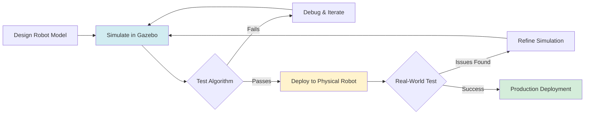
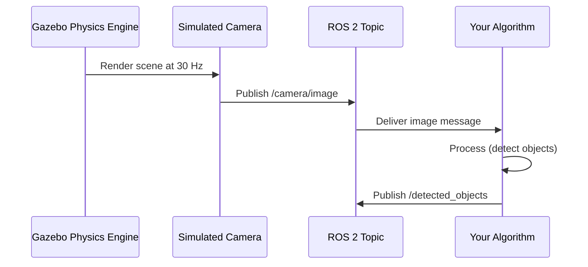
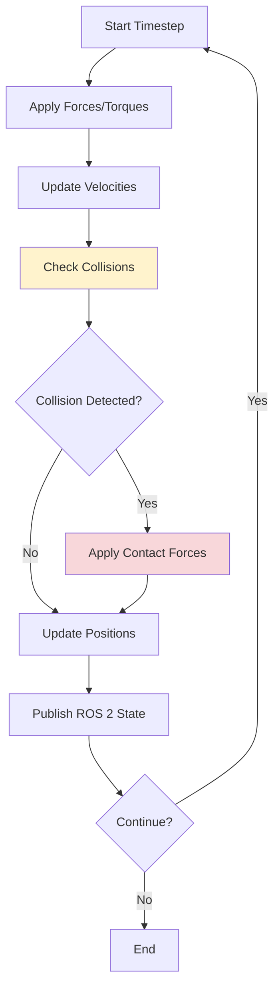

# The Digital Twin: Gazebo & Unity Simulation

> **Module**: 2 | **Estimated Reading Time**: 18 minutes

## Learning Objectives

By the end of this chapter, you will be able to:

- Explain what a digital twin is and why simulation accelerates robot development
- Launch Gazebo Classic simulations with ROS 2 integration
- Create sensor models (cameras, lidars) in simulation environments
- Understand sim-to-real transfer principles for deploying simulated robots

## Prerequisites

- Completed Module 1 (ROS 2 fundamentals)
- Basic understanding of 3D coordinate systems
- Linux terminal proficiency

---

## Introduction

Building physical robots is expensive and time-consuming. Every hardware failure costs money, and testing dangerous scenarios risks equipment damage. Digital twins solve this by creating virtual replicas of robots that behave like their physical counterparts. You can crash a simulated robot a thousand times, test in extreme conditions, and iterate rapidly—all at zero cost.

Gazebo is the industry-standard robot simulator, used by teams from Boston Dynamics to NASA. It provides realistic physics, sensor simulation, and seamless ROS 2 integration. Unity offers photorealistic rendering for computer vision tasks. Together, they enable safe, fast development before touching real hardware.

This chapter focuses on Gazebo Classic 11 (free-tier, CPU-only) with practical examples you can run immediately.

### Key Questions This Chapter Answers

- How do digital twins reduce robot development costs?
- What's the difference between Gazebo Classic and Gazebo Fortress?
- How do simulated sensors generate realistic data for testing?

---

## Section 1: Understanding Digital Twins

A digital twin is a virtual model that mirrors a physical system's behavior. For robots, this means simulating motors, sensors, physics, and environments. When you test code in simulation, the robot "thinks" it's moving in the real world—same ROS 2 topics, same message types, same control logic.

The key advantage: **rapid iteration**. Change a parameter, rerun the simulation instantly. No hardware setup, no battery charging, no physical space needed. Once your algorithm works in simulation, deploy it to real hardware with minimal changes.

### Mermaid Diagram: Digital Twin Development Workflow



**Diagram Explanation**: This workflow shows how digital twins accelerate development. You iterate quickly in simulation (blue), validate in the real world (yellow), and deploy when confident (green). Failures in simulation are free; failures in hardware are expensive.

### Code Example: Launch Gazebo with Empty World

```python
# launch_gazebo.py - Start Gazebo simulator with ROS 2
from launch import LaunchDescription
from launch.actions import IncludeLaunchDescription
from launch.launch_description_sources import PythonLaunchDescriptionSource
from launch_ros.substitutions import FindPackageShare
import os

def generate_launch_description():
    """Launch Gazebo Classic with empty world"""

    # Find Gazebo ROS package
    gazebo_pkg = FindPackageShare('gazebo_ros').find('gazebo_ros')
    gazebo_launch = os.path.join(gazebo_pkg, 'launch', 'gazebo.launch.py')

    return LaunchDescription([
        IncludeLaunchDescription(
            PythonLaunchDescriptionSource(gazebo_launch),
            launch_arguments={
                'world': 'worlds/empty.world',  # Empty simulation world
                'verbose': 'true'
            }.items()
        )
    ])
```

**What this code does**: Launches Gazebo with an empty world. This is the foundation for all simulations—add robot models and sensors to this environment.

**Dependencies**: `sudo apt install ros-humble-gazebo-ros-pkgs`

**Expected output**: Gazebo GUI opens with empty 3D environment

**Free-Tier Note**: ✅ CPU-only, uses Gazebo Classic 11

---

## Section 2: Simulating Robot Sensors

Sensors are a robot's eyes and ears. Gazebo simulates cameras, lidars, IMUs, and more. These virtual sensors publish ROS 2 messages identical to real hardware—your vision algorithms can't tell the difference.

### Mermaid Diagram: Sensor Data Flow in Gazebo



**Diagram Explanation**: Gazebo's physics engine renders the scene, the simulated camera publishes images to ROS 2 topics, and your algorithm processes them—exactly like real hardware.

### Code Example: Add Camera Sensor to Robot

```python
# camera_plugin.py - Simulated camera configuration
import xacro

camera_urdf = """
<gazebo reference="camera_link">
  <sensor type="camera" name="front_camera">
    <update_rate>30.0</update_rate>
    <camera>
      <horizontal_fov>1.3962634</horizontal_fov>
      <image>
        <width>640</width>
        <height>480</height>
        <format>R8G8B8</format>
      </image>
      <clip>
        <near>0.02</near>
        <far>300</far>
      </clip>
    </camera>
    <plugin name="camera_controller" filename="libgazebo_ros_camera.so">
      <ros>
        <namespace>/robot</namespace>
        <remapping>image_raw:=/camera/image</remapping>
        <remapping>camera_info:=/camera/info</remapping>
      </ros>
      <camera_name>front_camera</camera_name>
      <frame_name>camera_link</frame_name>
    </plugin>
  </sensor>
</gazebo>
"""

# Usage: Add this URDF snippet to your robot description file
print("Camera sensor configured at 640x480, 30 Hz")
```

**What this code does**: Configures a virtual camera that publishes to `/camera/image`. Adjust resolution and frame rate for performance tuning.

**Dependencies**: `ros-humble-gazebo-plugins`

**Expected output**: Camera images appear on `/camera/image` topic

**Free-Tier Note**: ✅ CPU rendering, lower resolutions recommended

---

## Section 3: Physics and Collision Detection

Gazebo uses physics engines (ODE, Bullet) to simulate gravity, friction, and collisions. Your robot model needs proper mass, inertia, and contact properties to behave realistically.

### Mermaid Diagram: Physics Simulation Loop



**Diagram Explanation**: Each simulation timestep applies physics laws. Collisions (yellow) trigger contact forces (red) that prevent objects from passing through each other.

### Code Example: Robot with Collision Properties

```python
# collision_config.py - Define collision geometry
collision_urdf = """
<link name="base_link">
  <collision>
    <geometry>
      <box size="0.5 0.3 0.2"/>  <!-- Width, depth, height in meters -->
    </geometry>
  </collision>
  <inertial>
    <mass value="10.0"/>  <!-- kg -->
    <inertia ixx="0.1" ixy="0" ixz="0"
             iyy="0.1" iyz="0"
             izz="0.1"/>
  </inertial>
</link>

<gazebo reference="base_link">
  <material>Gazebo/Grey</material>
  <mu1>0.8</mu1>  <!-- Friction coefficient -->
  <mu2>0.8</mu2>
</gazebo>
"""

print("Collision geometry: 0.5m x 0.3m x 0.2m box with 10kg mass")
```

**What this code does**: Defines collision box and physics properties. Accurate inertia tensors are critical for realistic motion.

**Dependencies**: Standard URDF format

**Expected output**: Robot collides realistically with environment

**Free-Tier Note**: ✅ CPU physics simulation

---

## Section 4: Sim-to-Real Transfer

The ultimate goal: algorithms that work in simulation AND on real robots. Sim-to-real transfer is challenging because simulations are imperfect. Key strategies:

1. **Domain Randomization**: Vary lighting, textures, physics in simulation to make algorithms robust
2. **System Identification**: Measure real robot parameters (mass, friction) and match them in simulation
3. **Sensor Noise Models**: Add realistic noise to simulated sensor data

### Code Example: Add Sensor Noise

```python
# sensor_noise.py - Realistic camera noise model
sensor_with_noise = """
<gazebo reference="camera_link">
  <sensor type="camera" name="noisy_camera">
    <camera>
      <noise>
        <type>gaussian</type>
        <mean>0.0</mean>
        <stddev>0.007</stddev>  <!-- Match real camera specs -->
      </noise>
    </camera>
    <plugin name="camera_controller" filename="libgazebo_ros_camera.so">
      <ros>
        <namespace>/robot</namespace>
        <remapping>image_raw:=/camera/noisy_image</remapping>
      </ros>
    </plugin>
  </sensor>
</gazebo>
"""

print("Gaussian noise added: mean=0.0, stddev=0.007")
```

**What this code does**: Adds Gaussian noise to camera images, matching real sensor specifications. Algorithms trained on noisy simulation data generalize better.

**Dependencies**: `gazebo_ros_camera` plugin

**Expected output**: Noisier but more realistic camera feed

---

## Common Pitfalls & Troubleshooting

### Issue 1: Gazebo Crashes on Launch

**Solution**: Check ROS 2 and Gazebo versions match:
```bash
ros2 pkg list | grep gazebo
# Should show gazebo_ros packages for Humble
```

### Issue 2: Simulated Sensors Publish No Data

**Solution**: Verify plugin loaded correctly:
```bash
ros2 topic list | grep camera
ros2 topic hz /camera/image  # Check publish rate
```

### Issue 3: Physics Behaves Unrealistically

**Solution**: Tune timestep and solver iterations in world file:
```xml
<physics type="ode">
  <max_step_size>0.001</max_step_size>
  <real_time_factor>1.0</real_time_factor>
</physics>
```

---

## Summary

Digital twins revolutionize robot development by enabling safe, fast iteration in simulation. Gazebo provides realistic physics and sensor models that integrate seamlessly with ROS 2. By matching simulation parameters to real hardware (sensor noise, friction, mass), you achieve reliable sim-to-real transfer.

**Key Takeaways**:
- Digital twins reduce development costs by testing algorithms in simulation first
- Gazebo simulates physics, collisions, and sensors with ROS 2 integration
- Sensor noise models and domain randomization improve sim-to-real transfer
- CPU-only Gazebo Classic works for most robotics applications

---

## References

- [Gazebo Classic Documentation](http://classic.gazebosim.org/) - Official Gazebo Classic 11 docs
- [ROS 2 Gazebo Integration](https://github.com/ros-simulation/gazebo_ros_pkgs) - gazebo_ros packages
- [URDF Tutorial](http://wiki.ros.org/urdf/Tutorials) - Robot modeling format
- [Sim-to-Real Transfer Paper](https://arxiv.org/abs/1703.06907) - Domain randomization techniques

---

## Next Steps

**Continue your learning journey**:

→ [AI-Robot Brain: NVIDIA Isaac](../module3/ai-robot-brain-nvidia-isaac.md)

**Optional Exercises**:
1. Create a custom robot URDF with lidar sensor
2. Build a maze world and test navigation algorithms
3. Compare CPU vs GPU rendering performance

---

**Last Updated**: 2025-12-07
**Chapter Maintainer**: Physical AI Textbook Team
