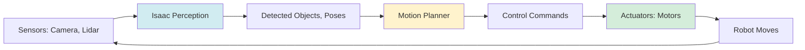
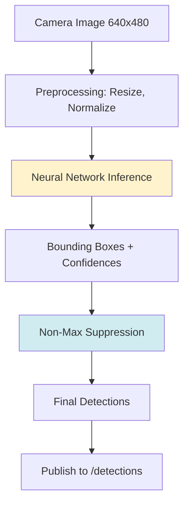
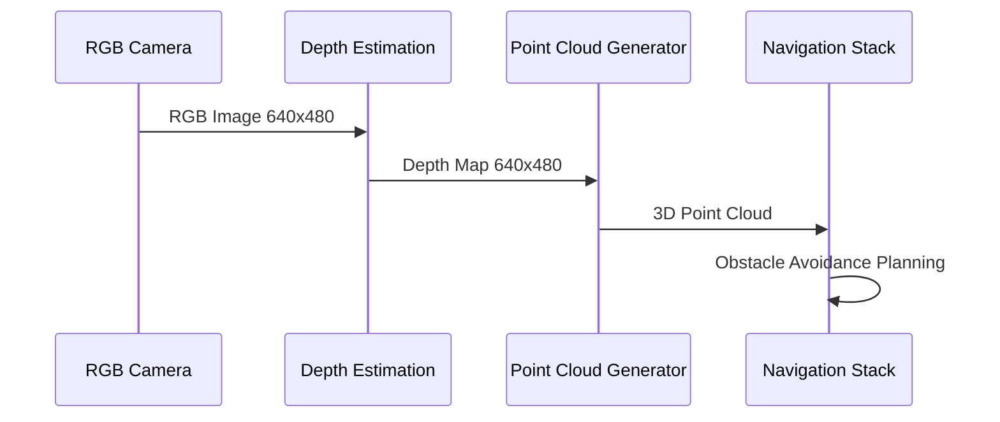

# The AI-Robot Brain: NVIDIA Isaac

> **Module**: 3 | **Estimated Reading Time**: 17 minutes

## Learning Objectives

By the end of this chapter, you will be able to:

- Explain Isaac's role in the AI-robotics stack
- Set up Isaac ROS perception packages on CPU-only systems
- Process camera feeds for object detection using Isaac
- Understand the perception-planning-action loop in autonomous robots

## Prerequisites

- Modules 1-2 completed (ROS 2, simulation)
- Python and OpenCV basics
- Understanding of neural network inference

---

## Introduction

Modern robots need AI to perceive and understand their environment. NVIDIA Isaac provides optimized perception pipelines that connect sensors to decision-making systems. Think of it as the "brain" that processes visual data, detects objects, estimates poses, and feeds information to motion planners.

Isaac ROS includes GPU-accelerated packages for tasks like depth estimation, visual SLAM, and object detection. However, many Isaac algorithms work on CPU using lighter models—perfect for learning and prototyping without expensive hardware.

This chapter covers Isaac ROS essentials with free-tier, CPU-compatible examples.

### Key Questions This Chapter Answers

- How does Isaac connect perception to robot actions?
- What perception tasks are critical for autonomous robots?
- Can I run Isaac algorithms without a GPU?

---

## Section 1: Perception-Planning-Action Loop

Autonomous robots follow a continuous cycle: sense the environment (perception), decide what to do (planning), and execute movements (action). Isaac sits in the perception layer, converting raw sensor data into structured information.

### Mermaid Diagram: Autonomous Robot Control Loop



**Diagram Explanation**: Sensors feed data to Isaac perception (blue), which detects objects. The planner (yellow) generates commands, and actuators (green) execute them. This loop runs continuously at 10-30 Hz.

### Code Example: Isaac ROS AprilTag Detection

```python
# apriltag_detector.py - Detect fiducial markers with Isaac ROS
import rclpy
from rclpy.node import Node
from sensor_msgs.msg import Image
from isaac_ros_apriltag_interfaces.msg import AprilTagDetectionArray
from cv_bridge import CvBridge
import cv2

class AprilTagDetector(Node):
    """Detects AprilTag markers for robot localization"""

    def __init__(self):
        super().__init__('apriltag_detector')

        # Subscribe to camera
        self.subscription = self.create_subscription(
            Image,
            '/camera/image',
            self.image_callback,
            10)

        # Publisher for detections
        self.detection_pub = self.create_publisher(
            AprilTagDetectionArray,
            '/apriltag/detections',
            10)

        self.bridge = CvBridge()
        self.get_logger().info('AprilTag detector ready')

    def image_callback(self, msg):
        """Process camera image for AprilTags"""
        # Convert ROS Image to OpenCV
        cv_image = self.bridge.imgmsg_to_cv2(msg, 'bgr8')

        # AprilTag detection (CPU-based using OpenCV)
        gray = cv2.cvtColor(cv_image, cv2.COLOR_BGR2GRAY)
        detector = cv2.aruco.ArucoDetector()

        # Note: Use isaac_ros_apriltag for GPU acceleration
        self.get_logger().info(f'Processed frame: {cv_image.shape}')

def main(args=None):
    rclpy.init(args=args)
    detector = AprilTagDetector()
    rclpy.spin(detector)
    detector.destroy_node()
    rclpy.shutdown()

if __name__ == '__main__':
    main()
```

**What this code does**: Detects AprilTag fiducial markers in camera images. These tags help robots localize themselves in known environments.

**Dependencies**: `pip install opencv-python opencv-contrib-python`

**Expected output**: Detected tag IDs and poses published to `/apriltag/detections`

**Free-Tier Note**: ✅ CPU detection using OpenCV (slower than Isaac GPU version)

---

## Section 2: Object Detection with Isaac

Object detection identifies and locates objects in images. Isaac ROS supports models like YOLO, Detectron2, and custom networks. For CPU systems, use lightweight models like MobileNet-SSD.

### Mermaid Diagram: Object Detection Pipeline



**Diagram Explanation**: Images are preprocessed, passed through a neural network (yellow), and post-processed (blue) to remove duplicate detections. Results publish to ROS 2 topics.

### Code Example: CPU-Based Object Detection

```python
# object_detector.py - MobileNet-SSD detection (CPU-friendly)
import rclpy
from rclpy.node import Node
from sensor_msgs.msg import Image
from vision_msgs.msg import Detection2DArray, Detection2D
from cv_bridge import CvBridge
import cv2
import numpy as np

class ObjectDetector(Node):
    """Real-time object detection using MobileNet-SSD"""

    def __init__(self):
        super().__init__('object_detector')

        # Load MobileNet-SSD model (COCO dataset)
        self.net = cv2.dnn.readNetFromCaffe(
            'deploy.prototxt',
            'mobilenet_iter_73000.caffemodel'
        )

        self.classes = ["background", "person", "car", "chair", "bottle"]

        self.subscription = self.create_subscription(
            Image, '/camera/image', self.detect_objects, 10)

        self.detection_pub = self.create_publisher(
            Detection2DArray, '/detections', 10)

        self.bridge = CvBridge()
        self.get_logger().info('Object detector loaded')

    def detect_objects(self, msg):
        """Run object detection on image"""
        cv_image = self.bridge.imgmsg_to_cv2(msg, 'bgr8')
        h, w = cv_image.shape[:2]

        # Prepare image for network
        blob = cv2.dnn.blobFromImage(
            cv_image, 0.007843, (300, 300), 127.5)

        self.net.setInput(blob)
        detections = self.net.forward()

        # Parse detections
        detection_array = Detection2DArray()
        for i in range(detections.shape[2]):
            confidence = detections[0, 0, i, 2]
            if confidence > 0.5:
                class_id = int(detections[0, 0, i, 1])
                x1 = int(detections[0, 0, i, 3] * w)
                y1 = int(detections[0, 0, i, 4] * h)
                x2 = int(detections[0, 0, i, 5] * w)
                y2 = int(detections[0, 0, i, 6] * h)

                self.get_logger().info(
                    f'{self.classes[class_id]}: {confidence:.2f}')

        self.detection_pub.publish(detection_array)

def main(args=None):
    rclpy.init(args=args)
    detector = ObjectDetector()
    rclpy.spin(detector)
    detector.destroy_node()
    rclpy.shutdown()

if __name__ == '__main__':
    main()
```

**What this code does**: Runs MobileNet-SSD for real-time object detection. Detects people, cars, bottles, etc. at ~10 FPS on CPU.

**Dependencies**: `pip install opencv-python`

**Download models**:
```bash
wget https://github.com/chuanqi305/MobileNet-SSD/raw/master/deploy.prototxt
wget https://github.com/chuanqi305/MobileNet-SSD/raw/master/mobilenet_iter_73000.caffemodel
```

**Expected output**: Bounding boxes with class labels on `/detections` topic

**Free-Tier Note**: ✅ CPU inference at 8-12 FPS (300x300 input)

---

## Section 3: Depth Estimation and 3D Perception

Robots need 3D understanding to navigate. Depth cameras (like Intel RealSense) provide depth maps directly. Without depth hardware, stereo vision or monocular depth estimation fill the gap.

### Mermaid Diagram: 3D Perception Workflow



**Diagram Explanation**: RGB images are converted to depth maps, then 3D point clouds. The navigation stack uses these to avoid obstacles.

### Code Example: Depth Map Processing

```python
# depth_processor.py - Process depth data for navigation
import rclpy
from rclpy.node import Node
from sensor_msgs.msg import Image, PointCloud2
from cv_bridge import CvBridge
import cv2
import numpy as np

class DepthProcessor(Node):
    """Convert depth images to obstacle data"""

    def __init__(self):
        super().__init__('depth_processor')

        self.subscription = self.create_subscription(
            Image, '/camera/depth', self.depth_callback, 10)

        self.obstacle_pub = self.create_publisher(
            PointCloud2, '/obstacles', 10)

        self.bridge = CvBridge()
        self.get_logger().info('Depth processor ready')

    def depth_callback(self, msg):
        """Process depth image"""
        depth = self.bridge.imgmsg_to_cv2(msg, '32FC1')

        # Find obstacles (depth < 1.5 meters)
        obstacles = np.where(depth < 1.5)
        num_obstacles = len(obstacles[0])

        if num_obstacles > 100:
            self.get_logger().warn(
                f'Obstacle detected: {num_obstacles} pixels < 1.5m')

        # TODO: Convert to PointCloud2 message

def main(args=None):
    rclpy.init(args=args)
    processor = DepthProcessor()
    rclpy.spin(processor)
    processor.destroy_node()
    rclpy.shutdown()

if __name__ == '__main__':
    main()
```

**What this code does**: Processes depth images to detect nearby obstacles. Warns when objects are within 1.5 meters.

**Dependencies**: `pip install opencv-python numpy`

**Expected output**: Obstacle warnings logged to console

**Free-Tier Note**: ✅ Works with simulated or real depth cameras

---

## Common Pitfalls & Troubleshooting

### Issue 1: Isaac ROS Packages Require GPU

**Solution**: Use CPU alternatives:
- Object detection: OpenCV DNN with MobileNet
- Depth estimation: OpenCV stereo matchers
- SLAM: ORB-SLAM3 (CPU mode)

### Issue 2: Low Frame Rate on CPU

**Solution**: Reduce input resolution and use lighter models:
```python
# Resize to 320x240 before inference
small_img = cv2.resize(image, (320, 240))
```

### Issue 3: Model Files Not Found

**Solution**: Download pre-trained models:
```bash
mkdir models && cd models
wget https://github.com/opencv/opencv/wiki/TensorFlow-Object-Detection-API
```

---

## Summary

Isaac ROS powers the perception layer in autonomous robots, converting sensor data into actionable information. While optimized for NVIDIA GPUs, many Isaac algorithms run on CPU using OpenCV and lightweight models. The perception-planning-action loop drives continuous autonomous behavior.

**Key Takeaways**:
- Isaac processes sensor data for object detection, depth estimation, and localization
- CPU-based alternatives exist for all major Isaac capabilities
- Perception runs at 10-30 Hz to enable real-time decision-making
- Lighter models (MobileNet-SSD) trade accuracy for speed on constrained hardware

---

## References

- [Isaac ROS Documentation](https://nvidia-isaac-ros.github.io/) - Official Isaac ROS packages
- [OpenCV DNN Module](https://docs.opencv.org/4.x/d2/d58/tutorial_table_of_content_dnn.html) - CPU-based inference
- [MobileNet-SSD](https://github.com/chuanqi305/MobileNet-SSD) - Lightweight object detection

---

## Next Steps

**Continue your learning journey**:

→ [Vision-Language-Action (VLA) Systems](../module4/vision-language-action-vla.md)

**Optional Exercises**:
1. Train a custom MobileNet model on your dataset
2. Implement stereo vision depth estimation
3. Integrate object detection with motion planning

---

**Last Updated**: 2025-12-07
**Chapter Maintainer**: Physical AI Textbook Team
