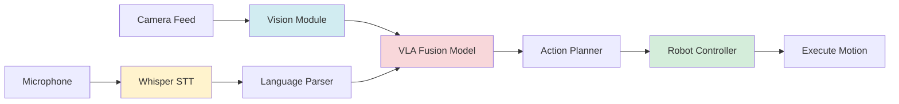
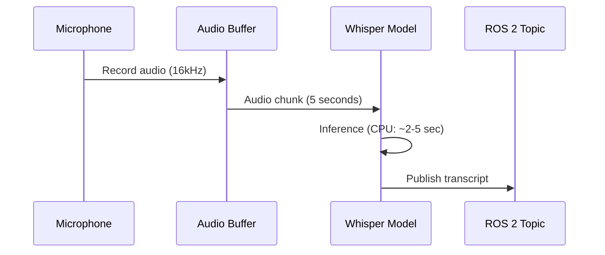
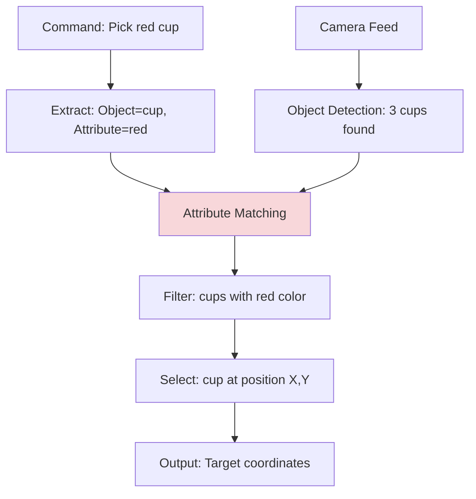

# Vision-Language-Action (VLA) Systems

> **Module**: 4 | **Estimated Reading Time**: 19 minutes

## Learning Objectives

By the end of this chapter, you will be able to:

- Explain how VLA models combine vision, language, and robotics
- Process voice commands using local Whisper (CPU-only)
- Build a simple VLA pipeline with OpenCV and language models
- Understand grounding: mapping language to robot actions

## Prerequisites

- Modules 1-3 completed
- Basic NLP concepts (tokenization, embeddings)
- Python and OpenCV proficiency

---

## Introduction

Imagine telling a robot: "Pick up the red cup on the table." The robot must see the scene (vision), understand your command (language), and execute the grasp (action). VLA systems make this possible by bridging these three modalities.

Recent models like RT-2 and PaLM-E integrate large language models with robot control, enabling natural language instructions. While production VLA systems require expensive compute, you can build educational VLA pipelines using local Whisper for speech recognition, OpenCV for vision, and simple action mappings—all free-tier and CPU-compatible.

This chapter demonstrates practical VLA concepts without paid APIs.

### Key Questions This Chapter Answers

- How do robots ground language commands in visual scenes?
- Can I run VLA-like systems without cloud APIs or GPUs?
- What's the difference between VLA and traditional robot programming?

---

## Section 1: The VLA Pipeline

A VLA system follows this flow: capture visual input (camera), receive language command (speech/text), fuse the modalities, and execute robot actions. The challenge is grounding—mapping abstract language to specific objects and motions in the real world.

### Mermaid Diagram: VLA System Architecture



**Diagram Explanation**: Vision (blue) detects objects, Whisper (yellow) transcribes speech, the fusion model (red) grounds language in the scene, and the controller (green) executes actions.

### Code Example: VLA Command Parser

```python
# vla_parser.py - Parse natural language robot commands
import rclpy
from rclpy.node import Node
from std_msgs.msg import String
import re

class VLACommandParser(Node):
    """Parse voice commands into robot actions"""

    def __init__(self):
        super().__init__('vla_parser')

        # Subscribe to transcribed speech
        self.subscription = self.create_subscription(
            String, '/voice/transcript', self.parse_command, 10)

        # Publish parsed actions
        self.action_pub = self.create_publisher(
            String, '/robot/action', 10)

        # Simple action vocabulary
        self.actions = {
            'pick': 'GRASP',
            'grab': 'GRASP',
            'place': 'RELEASE',
            'put': 'RELEASE',
            'move': 'NAVIGATE',
            'go': 'NAVIGATE'
        }

        self.get_logger().info('VLA parser ready')

    def parse_command(self, msg):
        """Extract action and object from command"""
        command = msg.data.lower()
        self.get_logger().info(f'Parsing: "{command}"')

        # Simple keyword matching (real VLA uses LLMs)
        action = None
        for keyword, action_type in self.actions.items():
            if keyword in command:
                action = action_type
                break

        if action:
            # Extract object (words after action keyword)
            match = re.search(r'(pick|grab|place|put|move|go)\s+(?:the\s+)?(\w+)', command)
            if match:
                obj = match.group(2)
                action_msg = String()
                action_msg.data = f'{action}:{obj}'
                self.action_pub.publish(action_msg)
                self.get_logger().info(f'Action: {action}, Object: {obj}')
            else:
                self.get_logger().warn('No object detected in command')
        else:
            self.get_logger().warn('Unknown action')

def main(args=None):
    rclpy.init(args=args)
    parser = VLACommandParser()
    rclpy.spin(parser)
    parser.destroy_node()
    rclpy.shutdown()

if __name__ == '__main__':
    main()
```

**What this code does**: Parses commands like "pick the cup" into structured actions (`GRASP:cup`). Production systems use LLMs for robust parsing.

**Dependencies**: `pip install rclpy`

**Expected output**: Parsed actions on `/robot/action` topic

**Free-Tier Note**: ✅ Simple rule-based parsing (no API calls)

---

## Section 2: Local Speech Recognition with Whisper

Whisper is OpenAI's speech-to-text model, available for local CPU inference. It converts voice commands to text without cloud APIs—perfect for robots in offline environments.

### Mermaid Diagram: Speech-to-Text Pipeline



**Diagram Explanation**: Audio is buffered, processed by Whisper in ~2-5 seconds on CPU, and published as text.

### Code Example: Whisper Speech-to-Text

```python
# whisper_stt.py - Local speech recognition (CPU)
import rclpy
from rclpy.node import Node
from std_msgs.msg import String
import whisper
import pyaudio
import numpy as np
import wave

class WhisperSTT(Node):
    """Whisper-based speech-to-text node"""

    def __init__(self):
        super().__init__('whisper_stt')

        # Load Whisper model (tiny = fastest on CPU)
        self.model = whisper.load_model('tiny')
        self.get_logger().info('Whisper model loaded (tiny)')

        self.transcript_pub = self.create_publisher(
            String, '/voice/transcript', 10)

        # Audio config
        self.audio = pyaudio.PyAudio()
        self.stream = self.audio.open(
            format=pyaudio.paInt16,
            channels=1,
            rate=16000,
            input=True,
            frames_per_buffer=1024
        )

        self.timer = self.create_timer(5.0, self.record_and_transcribe)

    def record_and_transcribe(self):
        """Record 5 seconds and transcribe"""
        self.get_logger().info('Recording...')

        frames = []
        for _ in range(0, int(16000 / 1024 * 5)):  # 5 seconds
            data = self.stream.read(1024)
            frames.append(data)

        # Save to WAV
        wf = wave.open('temp.wav', 'wb')
        wf.setnchannels(1)
        wf.setsampwidth(self.audio.get_sample_size(pyaudio.paInt16))
        wf.setframerate(16000)
        wf.writeframes(b''.join(frames))
        wf.close()

        # Transcribe
        result = self.model.transcribe('temp.wav', fp16=False)
        text = result['text'].strip()

        if text:
            msg = String()
            msg.data = text
            self.transcript_pub.publish(msg)
            self.get_logger().info(f'Transcript: "{text}"')

def main(args=None):
    rclpy.init(args=args)
    stt = WhisperSTT()
    rclpy.spin(stt)
    stt.destroy_node()
    rclpy.shutdown()

if __name__ == '__main__':
    main()
```

**What this code does**: Records 5-second audio clips and transcribes them using Whisper's `tiny` model (~39M parameters, fast on CPU).

**Dependencies**:
```bash
pip install openai-whisper pyaudio
```

**Expected output**: Transcribed text on `/voice/transcript` topic

**Free-Tier Note**: ✅ Local inference, no API key needed (CPU: ~3 sec/clip)

---

## Section 3: Visual Grounding - Linking Language to Objects

Grounding connects words to visual entities. When a user says "red cup," the vision system must locate the red cup in the camera feed. This requires object detection + attribute matching.

### Mermaid Diagram: Visual Grounding Process



**Diagram Explanation**: Language parsing extracts object + attributes. Vision detects candidates. Attribute matching (red) grounds the command to a specific object.

### Code Example: Visual Grounding with Color Filtering

```python
# visual_grounding.py - Ground language commands in visual scenes
import rclpy
from rclpy.node import Node
from sensor_msgs.msg import Image
from std_msgs.msg import String
from cv_bridge import CvBridge
import cv2
import numpy as np

class VisualGrounding(Node):
    """Ground language commands to visual objects"""

    def __init__(self):
        super().__init__('visual_grounding')

        self.bridge = CvBridge()
        self.latest_image = None

        # Subscribe to camera and commands
        self.create_subscription(
            Image, '/camera/image', self.image_callback, 10)
        self.create_subscription(
            String, '/robot/action', self.ground_command, 10)

        self.get_logger().info('Visual grounding ready')

    def image_callback(self, msg):
        """Store latest image"""
        self.latest_image = self.bridge.imgmsg_to_cv2(msg, 'bgr8')

    def ground_command(self, msg):
        """Locate object in scene"""
        if self.latest_image is None:
            return

        # Parse action (e.g., "GRASP:red_cup")
        parts = msg.data.split(':')
        if len(parts) != 2:
            return

        action, target = parts
        self.get_logger().info(f'Grounding: {target}')

        # Simple color-based grounding
        if 'red' in target:
            hsv = cv2.cvtColor(self.latest_image, cv2.COLOR_BGR2HSV)
            # Red color range in HSV
            mask = cv2.inRange(hsv, (0, 100, 100), (10, 255, 255))

            # Find contours
            contours, _ = cv2.findContours(
                mask, cv2.RETR_EXTERNAL, cv2.CHAIN_APPROX_SIMPLE)

            if contours:
                largest = max(contours, key=cv2.contourArea)
                M = cv2.moments(largest)
                if M['m00'] > 0:
                    cx = int(M['m10'] / M['m00'])
                    cy = int(M['m01'] / M['m00'])
                    self.get_logger().info(
                        f'Red object found at ({cx}, {cy})')

def main(args=None):
    rclpy.init(args=args)
    grounding = VisualGrounding()
    rclpy.spin(grounding)
    grounding.destroy_node()
    rclpy.shutdown()

if __name__ == '__main__':
    main()
```

**What this code does**: Detects red objects using HSV color thresholding. Production VLA systems use vision-language models like CLIP.

**Dependencies**: `pip install opencv-python`

**Expected output**: Object coordinates logged to console

**Free-Tier Note**: ✅ Simple color-based grounding (no ML models)

---

## Section 4: End-to-End VLA Demo

Combining all components: voice command → object detection → action execution.

### Code Example: Complete VLA System

```python
# vla_system.py - Full VLA pipeline demonstration
import rclpy
from rclpy.node import Node
from std_msgs.msg import String
from geometry_msgs.msg import Twist

class VLASystem(Node):
    """Complete VLA system coordinator"""

    def __init__(self):
        super().__init__('vla_system')

        # Subscribe to grounded targets
        self.create_subscription(
            String, '/grounding/target', self.execute_action, 10)

        # Publisher for robot velocity
        self.cmd_vel_pub = self.create_publisher(Twist, '/cmd_vel', 10)

        self.get_logger().info('VLA system active')

    def execute_action(self, msg):
        """Execute grounded action"""
        # Parse target coordinates from grounding module
        # Format: "GRASP:x=320,y=240"

        self.get_logger().info(f'Executing: {msg.data}')

        # Simple action: move towards target
        cmd = Twist()
        cmd.linear.x = 0.2  # Move forward
        self.cmd_vel_pub.publish(cmd)

        # TODO: Add inverse kinematics for grasping

def main(args=None):
    rclpy.init(args=args)
    vla = VLASystem()
    rclpy.spin(vla)
    vla.destroy_node()
    rclpy.shutdown()

if __name__ == '__main__':
    main()
```

**What this code does**: Coordinates the full VLA pipeline from voice input to robot motion.

**Dependencies**: Standard ROS 2

**Expected output**: Robot moves towards detected targets

---

## Common Pitfalls & Troubleshooting

### Issue 1: Whisper Inference Too Slow

**Solution**: Use smaller models:
```python
model = whisper.load_model('tiny')  # 39M params, ~1-2 sec
# vs 'base' (74M), 'small' (244M), 'medium' (769M)
```

### Issue 2: Color-Based Grounding Fails in Different Lighting

**Solution**: Use adaptive thresholding or ML-based segmentation:
```python
# Adaptive color ranges
hsv = cv2.cvtColor(img, cv2.COLOR_BGR2HSV)
mask = cv2.inRange(hsv, lower_bound, upper_bound)
```

### Issue 3: Audio Recording Not Working

**Solution**: Check microphone permissions:
```bash
sudo usermod -a -G audio $USER
# Restart terminal
```

---

## Summary

VLA systems represent the future of human-robot interaction, enabling natural language control of physical actions. While state-of-the-art models like RT-2 require massive compute, educational VLA pipelines can run locally using Whisper (speech), OpenCV (vision), and simple action mappings.

**Key Takeaways**:
- VLA fuses vision, language, and action for intuitive robot control
- Local Whisper enables offline speech recognition on CPU
- Visual grounding maps language to objects in scenes
- Simple VLA demos work without cloud APIs or GPUs

---

## References

- [Whisper Documentation](https://github.com/openai/whisper) - Local speech recognition
- [RT-2 Paper](https://arxiv.org/abs/2307.15818) - Vision-language-action models
- [CLIP](https://github.com/openai/CLIP) - Vision-language grounding

---

## Next Steps

**Continue your learning journey**:

→ **Coming Soon:** Module 5 - Capstone Project: Building Your AI Robot

**Optional Exercises**:
1. Integrate CLIP for better visual grounding
2. Build a voice-controlled navigation robot
3. Train a custom VLA model on robot demonstrations

---

**Last Updated**: 2025-12-07
**Chapter Maintainer**: Physical AI Textbook Team
