# Mermaid Diagram Guidelines

Best practices for creating effective, clear, and render-safe Mermaid diagrams in educational chapters.

## Diagram Types & When to Use Them

### Flowchart (Most Common)
**Use for**: Architecture overviews, process flows, system components
**Syntax**: `flowchart LR` or `flowchart TD`
**Example Use Cases**:
- ROS 2 node architecture
- Data flow through systems
- Decision trees

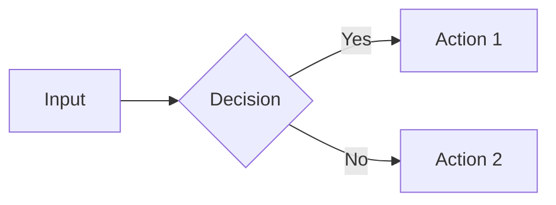

### Sequence Diagram
**Use for**: Communication patterns, message passing, time-ordered interactions
**Syntax**: `sequenceDiagram`
**Example Use Cases**:
- ROS 2 service request-response
- Publisher-subscriber interaction
- Multi-node coordination

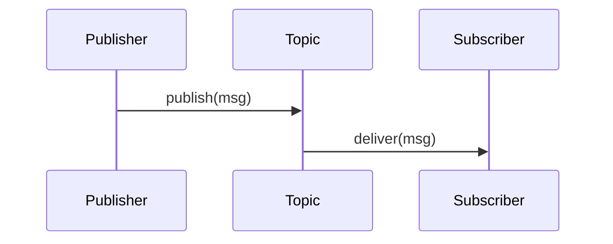

### Class Diagram
**Use for**: Object-oriented relationships, inheritance hierarchies, data structures
**Syntax**: `classDiagram`
**Example Use Cases**:
- ROS 2 node class hierarchy
- Robot component interfaces
- Software architecture patterns

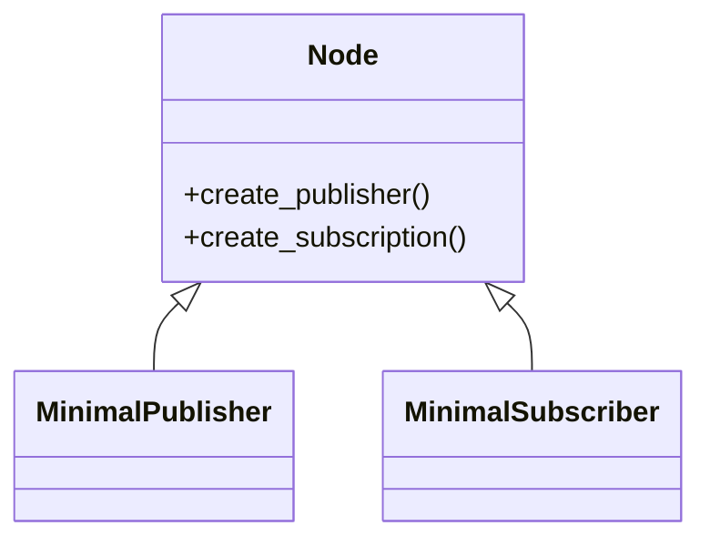

### State Diagram
**Use for**: State machines, robot behaviors, mode transitions
**Syntax**: `stateDiagram-v2`
**Example Use Cases**:
- Robot operational states
- Task execution lifecycle
- System initialization sequence

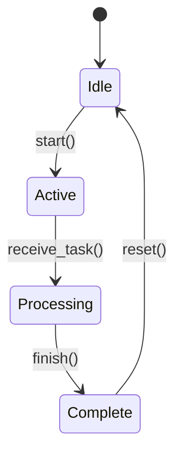

## Complexity Guidelines

### Keep It Simple
- **Maximum nodes**: 10-12 (more becomes unreadable)
- **Maximum depth**: 3-4 levels (avoid deep nesting)
- **Label length**: 3-8 words per node

### Bad Example (Too Complex)
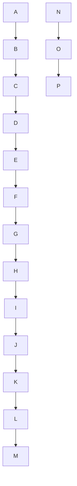

### Good Example (Simplified)
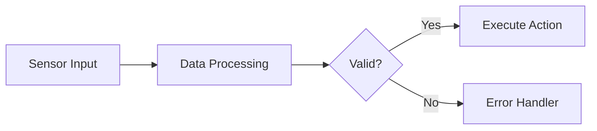

## Node Styling & Labels

### Use Descriptive Labels
- ✅ **Good**: `Publisher Node`, `ROS 2 Master`, `Sensor Data`
- ❌ **Bad**: `A`, `Thing`, `Process`

### Include Connection Labels When Needed
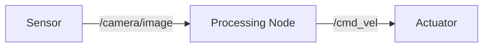

### Use Shapes to Convey Meaning
- `[Rectangle]` - Standard process/component
- `{Diamond}` - Decision point
- `((Circle))` - Start/end point
- `[(Database)]` - Data storage
- `[/Parallelogram/]` - Input/output

## Validation Before Commit

### Step 1: Test in Mermaid Live Editor
Visit https://mermaid.live/ and paste your diagram syntax to verify rendering.

### Step 2: Check Docusaurus Build
```bash
npm run build
```
Ensure no Mermaid rendering errors in console output.

### Step 3: Visual Review
View diagram in browser to confirm:
- All labels are readable
- Connections are clear
- Layout makes logical sense
- No overlapping elements

## Common Pitfalls

### Pitfall 1: Special Characters in Labels
**Problem**: Quotes, brackets, or parentheses break syntax
**Solution**: Use escape characters or simplified text

```mermaid
# ❌ Bad
flowchart LR
    A["Node (with parens)"] --> B

# ✅ Good
flowchart LR
    A[Node with parens] --> B
```

### Pitfall 2: Overly Long Labels
**Problem**: Text wrapping makes diagrams unreadable
**Solution**: Abbreviate or split into multiple nodes

```mermaid
# ❌ Bad
flowchart LR
    A[This is a very long label that will wrap and become difficult to read] --> B

# ✅ Good
flowchart LR
    A[Long Label] --> B
    Note[Description in caption]
```

### Pitfall 3: Missing Diagram Explanation
**Problem**: Diagram alone may not be self-explanatory
**Solution**: Always include plain-text explanation below diagram

```markdown
### Mermaid Diagram: ROS 2 Communication Flow


**Diagram Explanation**: This diagram shows how ROS 2 nodes communicate. The Publisher node sends messages to a Topic, which then delivers those messages to all Subscriber nodes listening on that topic.
```

## Accessibility Considerations

### Always Provide Plain-Text Alternative
After every diagram, include a text description that:
- Explains what the diagram shows
- Describes the flow or relationships
- Highlights key takeaways

**Example**:
```markdown
**Diagram Explanation**: This flowchart illustrates the three-stage pipeline in Vision-Language-Action systems. First, visual input from cameras is processed by computer vision algorithms. Second, natural language commands are parsed and interpreted. Third, the action planner combines both inputs to generate robot control commands. The feedback loop allows the system to adapt based on execution results.
```

## Performance Considerations

### Minimize Diagram Complexity for Build Speed
- Each Mermaid diagram adds ~50-100ms to build time
- Keep diagrams simple to meet < 2 minute build constraint
- Avoid deeply nested subgraphs

### Use Lazy Loading for Large Diagrams
If diagram is particularly complex, consider splitting into multiple simpler diagrams.

## Examples by Module

### Module 1 (ROS 2): Architecture & Communication
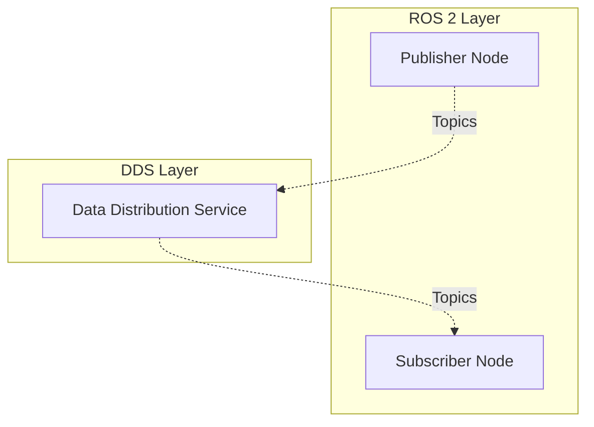

### Module 2 (Digital Twin): Simulation Pipeline
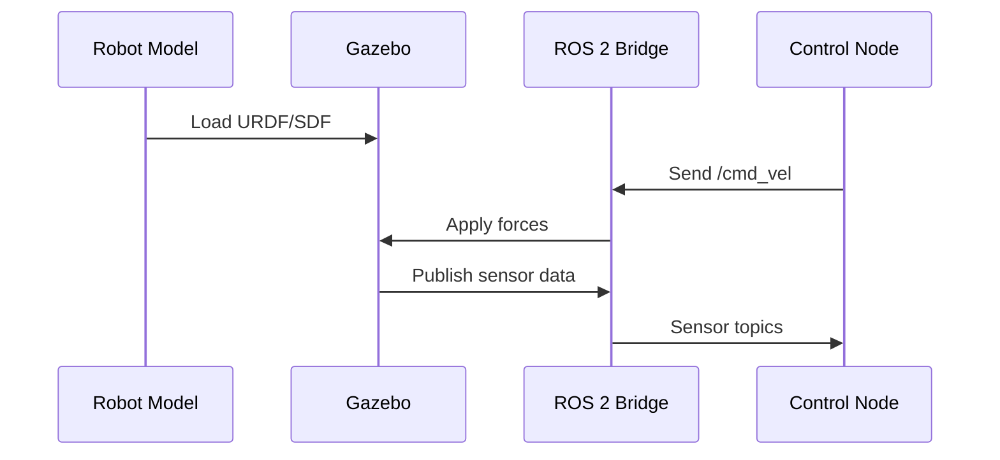

### Module 3 (NVIDIA Isaac): Perception-Action Loop
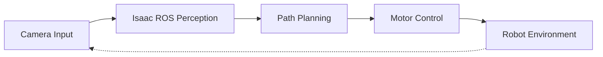

### Module 4 (VLA): Full VLA Pipeline
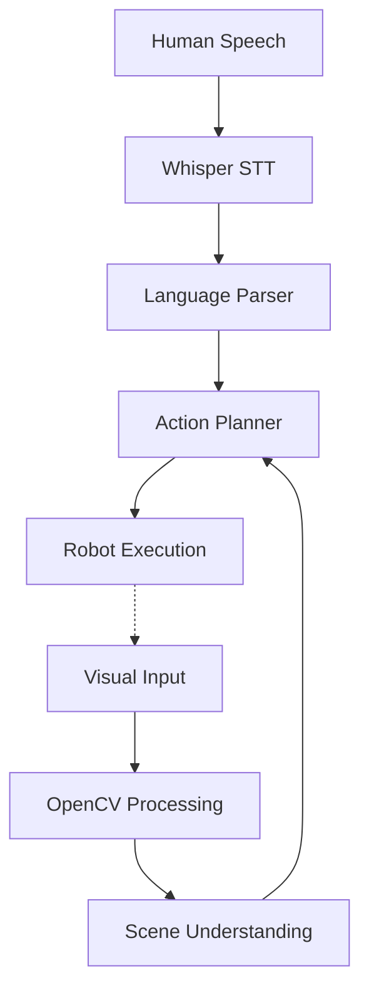

## Validation Checklist

Before committing a diagram:

- [ ] Diagram renders successfully in Mermaid Live Editor
- [ ] Node count ≤ 12
- [ ] All labels are descriptive (no single letters or cryptic abbreviations)
- [ ] Connection labels included where helpful
- [ ] Diagram type appropriate for content (flowchart, sequence, class, state)
- [ ] Plain-text explanation provided below diagram
- [ ] Tested in Docusaurus build (no rendering errors)
- [ ] Visual review confirms clarity and readability

---

**Last Updated**: 2025-12-07
