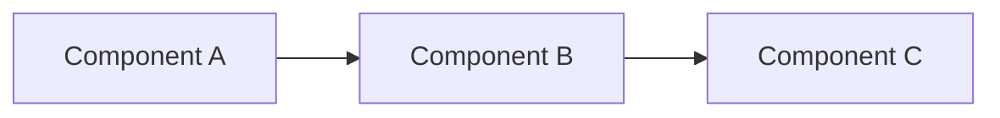

# Quickstart Guide: Contributing to Modules 1-4 Chapters

**Feature**: Detailed Chapters for Modules 1-4
**Branch**: `001-modules-1-4-chapters`
**Date**: 2025-12-07

## Overview

This guide helps contributors set up their environment and understand the workflow for creating or editing educational chapters for the Physical AI & Humanoid Robotics textbook.

## Prerequisites

- **Git**: Version 2.30 or later
- **Node.js**: Version 18 or later
- **Python**: Version 3.8 or later
- **Text Editor**: VS Code (recommended) or any markdown-capable editor

## Initial Setup

### Step 1: Clone Repository and Checkout Branch

```bash
cd /path/to/your/workspace
git clone <repository-url>
cd hackathon
git checkout 001-modules-1-4-chapters
```

### Step 2: Install Node.js Dependencies

```bash
npm install
```

**Expected time**: ~2-3 minutes (downloads Docusaurus and plugins)

### Step 3: Install Python Validation Tools

```bash
pip install textstat pytest
```

**What these do**:
- `textstat`: Calculates Flesch-Kincaid readability scores
- `pytest`: Runs code example execution tests

### Step 4: Verify Setup

```bash
npm run build
```

**Expected outcome**: Build completes successfully in < 2 minutes with no errors.

---

## Creating a New Chapter

### Step 1: Create Chapter Directory

```bash
mkdir -p docs/moduleX
```

Replace `X` with the module number (1-4).

### Step 2: Copy Chapter Template

```bash
cp specs/001-modules-1-4-chapters/contracts/chapter-template.md docs/moduleX/your-chapter-name.md
```

**Naming convention**: Use lowercase with hyphens (e.g., `robotic-nervous-system-ros2.md`)

### Step 3: Fill in Chapter Content

Open `docs/moduleX/your-chapter-name.md` and replace all `[placeholder]` text with actual content.

**Key sections to complete**:
1. **Title & Metadata**: Module number, estimated reading time
2. **Learning Objectives**: 3-5 actionable learning goals
3. **Prerequisites**: Required prior knowledge
4. **Core Sections**: 3-5 main concept sections
5. **Mermaid Diagrams**: 4-6 diagrams (use guidelines in `contracts/mermaid-diagram-guidelines.md`)
6. **Code Examples**: 5-8 runnable Python snippets
7. **References**: ≥5 official documentation links

**Content Guidelines**:
- Use active voice ("ROS 2 enables..." not "is enabled by...")
- Keep sentences short (15-20 words average)
- Define technical terms immediately
- Provide concrete examples, not abstractions
- Follow Flesch-Kincaid grade 10-12 readability

### Step 4: Add Mermaid Diagrams

**Validate syntax** using Mermaid Live Editor: https://mermaid.live/

```markdown
### Mermaid Diagram: [Descriptive Title]



**Diagram Explanation**: [Plain-text description for accessibility]
```

**Best practices**:
- Keep diagrams simple (max 10-12 nodes)
- Use descriptive labels (no single letters)
- Include plain-text explanation below each diagram
- See `contracts/mermaid-diagram-guidelines.md` for full guidelines

### Step 5: Write Code Examples

```markdown
### Code Example: [What it Demonstrates]

```python
import rclpy  # Required library
from rclpy.node import Node

# Create minimal node demonstrating concept
class ExampleNode(Node):
    def __init__(self):
        super().__init__('example_node')
        # Initialize node components
        self.timer = self.create_timer(1.0, self.callback)

    def callback(self):
        """Periodic callback demonstrating behavior"""
        self.get_logger().info('Example running')

def main():
    rclpy.init()
    node = ExampleNode()
    rclpy.spin(node)
    node.destroy_node()
    rclpy.shutdown()

if __name__ == '__main__':
    main()
```

**What this code does**: [1-2 sentence explanation]

**Dependencies**: `pip install rclpy`

**Expected output**:
```
[Sample output here]
```

**Free-Tier Note**: ✅ CPU-only execution, no GPU or paid services required.
```

**Code requirements**:
- Must run on Python 3.8+
- Must be CPU-only (no GPU dependencies)
- Must include inline comments explaining key steps
- Must use free-tier compatible libraries only
- See `contracts/code-example-schema.json` for validation schema

---

## Validation Workflow

### Validation 1: Check Readability & Word Count

```bash
python src/utils/readability-checker.py docs/moduleX/your-chapter.md
```

**Expected output**:
```
File: docs/moduleX/your-chapter.md
Word Count: 1450
Flesch-Kincaid Grade Level: 11.2
✅ Word count within range (1200-1600)
✅ Readability grade within range (10-12)
```

**If validation fails**:
- **Word count too low**: Add more explanatory content or examples
- **Word count too high**: Remove unnecessary details, tighten prose
- **Readability too high** (>12): Simplify sentences, break long paragraphs
- **Readability too low** (<10): Add technical depth, expand explanations

### Validation 2: Test Code Examples

Extract code examples from markdown and test execution:

```bash
pytest tests/integration/test_code_examples.py::test_moduleX
```

**Expected outcome**: All code examples execute without errors.

**Common issues**:
- Missing dependencies: Add to `requirements.txt` and retest
- Import errors: Verify package names and versions
- Runtime errors: Debug code, ensure CPU-only compatibility

### Validation 3: Build Site Locally

```bash
npm run build
```

**Expected outcome**:
- Build completes in < 2 minutes
- Zero broken links
- All Mermaid diagrams render correctly

**If build fails**:
- Check Mermaid syntax errors in console output
- Verify all internal links use correct paths
- Ensure no malformed markdown syntax

### Validation 4: Visual Review

```bash
npm run start
```

**Opens local server**: http://localhost:3000

**Check visually**:
- Chapter appears in sidebar navigation
- All diagrams render correctly
- Code blocks have proper syntax highlighting
- Links navigate to correct pages
- Dark mode works (toggle in navbar)

---

## Updating sidebars.ts

After creating a chapter, add it to the sidebar configuration:

```typescript
// sidebars.ts
module.exports = {
  tutorialSidebar: [
    'intro',
    {
      type: 'category',
      label: 'Modules',
      items: [
        'module1/robotic-nervous-system-ros2',  // Add your chapter here
        'module2/digital-twin-gazebo-unity',
        'module3/ai-robot-brain-nvidia-isaac',
        'module4/vision-language-action-vla',
      ],
    },
  ],
};
```

**Path format**: `'moduleX/your-chapter-name'` (no `.md` extension)

---

## Committing Changes

### Step 1: Stage Files

```bash
git add docs/moduleX/your-chapter.md
git add sidebars.ts  # if updated
```

### Step 2: Commit with Descriptive Message

```bash
git commit -m "docs: add Module X chapter on [topic]

- Includes 5 Mermaid diagrams illustrating [concepts]
- Provides 7 runnable Python code examples
- Achieves Flesch-Kincaid readability grade 11.2
- All code examples tested and CPU-compatible

Satisfies constitutional principles: Simplicity, Accuracy, Minimalism, Free-Tier"
```

### Step 3: Push to Branch

```bash
git push origin 001-modules-1-4-chapters
```

---

## Troubleshooting

### Issue: Build time exceeds 2 minutes

**Diagnosis**: Check for unnecessary dependencies or large assets
**Solution**:
```bash
npm run build -- --profile  # Identify slow steps
```
Remove unused Docusaurus plugins, optimize images, minimize dependencies.

### Issue: Readability score too high (>12)

**Diagnosis**: Sentences too complex or too many long words
**Solution**:
- Break long sentences into shorter ones (aim for 15-20 words avg)
- Replace multi-syllable words with simpler alternatives
- Use active voice instead of passive
- Add transition words for clarity

### Issue: Code example fails to execute

**Diagnosis**: Missing dependencies or environment-specific issues
**Solution**:
1. Verify all imports are included in `dependencies` list
2. Test in fresh virtual environment:
   ```bash
   python -m venv test_env
   source test_env/bin/activate  # or test_env\Scripts\activate on Windows
   pip install [dependencies]
   python test_code.py
   ```
3. Check for GPU-specific code (e.g., `torch.cuda`, `tensorflow-gpu`)
4. Ensure no paid API keys required

### Issue: Mermaid diagram doesn't render

**Diagnosis**: Syntax error in Mermaid code
**Solution**:
1. Copy diagram syntax to https://mermaid.live/
2. Fix syntax errors highlighted by editor
3. Rebuild Docusaurus and verify rendering

### Issue: Broken links in build

**Diagnosis**: Invalid internal link paths
**Solution**:
- Check link format: `../moduleX/chapter-name.md` (relative) or `/docs/moduleX/chapter-name` (absolute)
- Verify target file exists at specified path
- Use `onBrokenLinks: 'throw'` in `docusaurus.config.js` to catch issues early

---

## Best Practices

### Writing Style
- ✅ **Do**: Use concrete examples ("ROS 2 publisher sends 'Hello World' message")
- ❌ **Don't**: Use abstract descriptions ("ROS 2 facilitates communication paradigms")

### Code Examples
- ✅ **Do**: Include expected output and execution instructions
- ❌ **Don't**: Provide code without context or explanation

### Diagrams
- ✅ **Do**: Keep diagrams simple (max 10-12 nodes)
- ❌ **Don't**: Create complex diagrams with 20+ nodes and deep nesting

### References
- ✅ **Do**: Link to official documentation (ros.org, gazebosim.org, nvidia.com)
- ❌ **Don't**: Link to unofficial blogs, tutorials, or outdated sources

---

## Getting Help

- **Specification Questions**: See `specs/001-modules-1-4-chapters/spec.md`
- **Technical Planning**: See `specs/001-modules-1-4-chapters/plan.md`
- **Data Model**: See `specs/001-modules-1-4-chapters/data-model.md`
- **Contracts & Templates**: See `specs/001-modules-1-4-chapters/contracts/`
- **Constitution**: See `.specify/memory/constitution.md` for project principles

---

**Last Updated**: 2025-12-07
