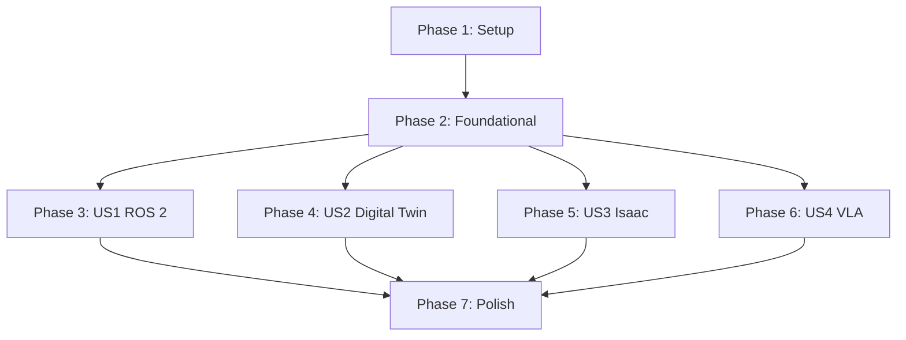

# Implementation Tasks: Detailed Chapters for Modules 1-4

**Feature**: Detailed Chapters for Modules 1-4
**Branch**: `001-modules-1-4-chapters`
**Date**: 2025-12-07
**Spec**: [spec.md](./spec.md) | **Plan**: [plan.md](./plan.md)

## Overview

This document breaks down the implementation of four educational chapters (Modules 1-4) for the Physical AI & Humanoid Robotics textbook into specific, executable tasks organized by user story priority.

**Total Estimated Tasks**: 31
**Phases**: 7 (Setup + Foundational + 4 User Stories + Polish)
**Parallel Opportunities**: 15 tasks can run concurrently within phases

---

## Phase 1: Setup & Infrastructure (3 tasks)

**Goal**: Initialize project structure and tooling required for all chapters

**Tasks**:

- [ ] T001 Create docs/ directory structure (docs/module1/, docs/module2/, docs/module3/, docs/module4/)
- [ ] T002 Create src/utils/ directory and add readability-checker.py script from research.md
- [ ] T003 Create tests/ directory structure (tests/integration/, tests/unit/)

**Completion Criteria**:
- All directories exist and are accessible
- readability-checker.py executes successfully with `python src/utils/readability-checker.py --help`

---

## Phase 2: Foundational (3 tasks)

**Goal**: Create shared infrastructure and validation tools needed across all chapters

**Blocking Dependencies**: None (can start after Phase 1)

**Tasks**:

- [ ] T004 [P] Install Python dependencies (textstat, pytest) and verify with `pip list`
- [ ] T005 [P] Create GitHub Actions workflow file .github/workflows/build-and-deploy.yml with build time monitoring
- [ ] T006 [P] Update docusaurus.config.js to enable Mermaid plugin and set onBrokenLinks: 'throw'

**Completion Criteria**:
- Python validation tools installed and functional
- GitHub Actions workflow validates locally (would run on push to main)
- Docusaurus config enables Mermaid rendering

---

## Phase 3: User Story 1 - Learn ROS 2 Fundamentals (Priority: P1)

**Story Goal**: Students understand ROS 2 as the foundational "nervous system" enabling robot component communication

**Independent Test**: Student can read Chapter 2, run all 5-8 code examples successfully, and create a basic publisher-subscriber node independently

**Blocking Dependencies**: Phase 2 must complete

**Tasks**:

- [ ] T007 [US1] Create docs/module1/robotic-nervous-system-ros2.md using chapter template from contracts/
- [ ] T008 [US1] Write introduction section (2-3 paragraphs) explaining ROS 2 purpose and importance for robotics
- [ ] T009 [US1] Write Section 1: ROS 2 Architecture (nodes, topics, services, actions) with inline examples
- [ ] T010 [P] [US1] Create Mermaid Diagram 1: ROS 2 graph architecture (nodes, topics, services) in docs/module1/robotic-nervous-system-ros2.md
- [ ] T011 [P] [US1] Create Mermaid Diagram 2: Publish-subscribe data flow sequence in docs/module1/robotic-nervous-system-ros2.md
- [ ] T012 [P] [US1] Create Mermaid Diagram 3: Service request-response pattern in docs/module1/robotic-nervous-system-ros2.md
- [ ] T013 [P] [US1] Create Mermaid Diagram 4: Action server feedback loop in docs/module1/robotic-nervous-system-ros2.md
- [ ] T014 [P] [US1] Create Mermaid Diagram 5: DDS layer abstraction in docs/module1/robotic-nervous-system-ros2.md
- [ ] T015 [US1] Write Section 2: Publish-Subscribe Pattern with concrete examples
- [ ] T016 [P] [US1] Add Code Example 1: Basic Publisher (minimal talker node) with inline comments
- [ ] T017 [P] [US1] Add Code Example 2: Basic Subscriber (minimal listener node) with inline comments
- [ ] T018 [P] [US1] Add Code Example 3: Publisher-Subscriber Pair demonstrating bi-directional communication
- [ ] T019 [P] [US1] Add Code Example 4: Service Client/Server (request-response pattern)
- [ ] T020 [P] [US1] Add Code Example 5: Action Client/Server (long-running task with feedback)
- [ ] T021 [P] [US1] Add Code Example 6: Parameter Declaration (node configuration)
- [ ] T022 [P] [US1] Add Code Example 7: Simple Timer (periodic callback demonstration)
- [ ] T023 [US1] Write Summary section recapping ROS 2 key takeaways
- [ ] T024 [US1] Add 5+ references to official ROS 2 Humble documentation with last verified dates
- [ ] T025 [US1] Add navigation link to next chapter: ../module2/digital-twin-gazebo-unity.md
- [ ] T026 [US1] Validate Chapter 2 readability: `python src/utils/readability-checker.py docs/module1/robotic-nervous-system-ros2.md`
- [ ] T027 [US1] Test all Chapter 2 code examples execute without errors (CPU-only validation)

**Independent Test Criteria**:
- Chapter 2 markdown file renders correctly in Docusaurus
- Word count between 1200-1600
- Flesch-Kincaid readability grade 10-12
- All 5-7 Mermaid diagrams render without errors
- All 5-7 code examples execute on CPU-only infrastructure
- Navigation link to Chapter 3 functional
- All technical claims reference official ROS 2 documentation

**Parallel Opportunities**:
- Tasks T010-T014 (Mermaid diagrams) can run concurrently after T009
- Tasks T016-T022 (code examples) can run concurrently after T015

---

## Phase 4: User Story 2 - Understand Digital Twin Simulation (Priority: P2)

**Story Goal**: Students learn how digital twins (Gazebo & Unity) enable testing robots in virtual environments before physical deployment

**Independent Test**: Student can read Chapter 3, understand simulation pipeline, run free-tier Gazebo examples, and explain digital twin benefits

**Blocking Dependencies**: Phase 2 complete (Phase 3 can run in parallel with this phase)

**Tasks**:

- [ ] T028 [US2] Create docs/module2/digital-twin-gazebo-unity.md using chapter template from contracts/
- [ ] T029 [US2] Write introduction section explaining digital twin concept and cost/time savings
- [ ] T030 [US2] Write Section 1: Digital Twin Fundamentals with definition and benefits
- [ ] T031 [P] [US2] Create Mermaid Diagram 1: Gazebo architecture (physics engine, rendering, plugins)
- [ ] T032 [P] [US2] Create Mermaid Diagram 2: Sensor pipeline (simulation → ROS 2 topics)
- [ ] T033 [P] [US2] Create Mermaid Diagram 3: Digital twin workflow (design → simulate → deploy)
- [ ] T034 [P] [US2] Create Mermaid Diagram 4: ROS 2-Gazebo bridge architecture
- [ ] T035 [US2] Write Section 2: Gazebo Simulation Environment with setup instructions
- [ ] T036 [P] [US2] Add Code Example 1: Empty World Spawn (launch Gazebo with basic environment)
- [ ] T037 [P] [US2] Add Code Example 2: Simple Robot Model (URDF/SDF robot description)
- [ ] T038 [P] [US2] Add Code Example 3: Sensor Simulation (camera, LiDAR, IMU data generation)
- [ ] T039 [P] [US2] Add Code Example 4: Physics Basics (gravity, collision, inertia)
- [ ] T040 [P] [US2] Add Code Example 5: ROS 2 Bridge (Gazebo-ROS 2 topic integration)
- [ ] T041 [P] [US2] Add Code Example 6: Teleoperation (keyboard control of simulated robot)
- [ ] T042 [P] [US2] Add Code Example 7: Sensor Data Visualization (RViz2 integration)
- [ ] T043 [US2] Write Section 3: Free-Tier Cloud Alternatives (GitHub Codespaces, AWS EC2 t2.micro)
- [ ] T044 [US2] Write Summary section on simulation benefits and next steps
- [ ] T045 [US2] Add 5+ references to Gazebo official documentation with last verified dates
- [ ] T046 [US2] Add navigation link to next chapter: ../module3/ai-robot-brain-nvidia-isaac.md
- [ ] T047 [US2] Validate Chapter 3 readability: `python src/utils/readability-checker.py docs/module2/digital-twin-gazebo-unity.md`
- [ ] T048 [US2] Test all Chapter 3 code examples execute without errors (CPU-only validation)

**Independent Test Criteria**:
- Chapter 3 markdown file renders correctly in Docusaurus
- Word count between 1200-1600
- Flesch-Kincaid readability grade 10-12
- All 4-6 Mermaid diagrams render without errors
- All 5-7 code examples execute on CPU-only Gazebo
- Free-tier alternatives clearly documented
- Navigation link to Chapter 4 functional

**Parallel Opportunities**:
- Phase 4 can run concurrently with Phase 3 (independent user stories)
- Tasks T031-T034 (Mermaid diagrams) can run concurrently after T030
- Tasks T036-T042 (code examples) can run concurrently after T035

---

## Phase 5: User Story 3 - Master NVIDIA Isaac for AI-Robot Integration (Priority: P3)

**Story Goal**: Students understand how NVIDIA Isaac serves as the "AI-robot brain" connecting perception, planning, and action

**Independent Test**: Student can read Chapter 4, understand Isaac's role in robot AI stack, and run cloud-based Isaac trial examples

**Blocking Dependencies**: Phase 2 complete (Phases 3-5 can run in parallel)

**Tasks**:

- [ ] T049 [US3] Create docs/module3/ai-robot-brain-nvidia-isaac.md using chapter template from contracts/
- [ ] T050 [US3] Write introduction section explaining Isaac's role in modern robotic systems
- [ ] T051 [US3] Write Section 1: NVIDIA Isaac Architecture and Ecosystem
- [ ] T052 [P] [US3] Create Mermaid Diagram 1: Isaac ROS architecture (nodes, perception pipeline)
- [ ] T053 [P] [US3] Create Mermaid Diagram 2: Perception-planning-action loop
- [ ] T054 [P] [US3] Create Mermaid Diagram 3: Isaac Sim cloud workflow (upload → simulate → analyze)
- [ ] T055 [P] [US3] Create Mermaid Diagram 4: AI-robot brain conceptual diagram
- [ ] T056 [US3] Write Section 2: Isaac ROS Open-Source Packages with installation guide
- [ ] T057 [P] [US3] Add Code Example 1: Isaac ROS Image Pipeline (CPU-based image processing)
- [ ] T058 [P] [US3] Add Code Example 2: Visual SLAM (simultaneous localization and mapping)
- [ ] T059 [P] [US3] Add Code Example 3: Object Detection (YOLOv8 integration)
- [ ] T060 [P] [US3] Add Code Example 4: Depth Estimation (stereo camera processing)
- [ ] T061 [P] [US3] Add Code Example 5: Isaac Sim Cloud Trial (basic robot simulation setup)
- [ ] T062 [P] [US3] Add Code Example 6: Perception-Action Loop (sensor input → planning → control)
- [ ] T063 [US3] Write Section 3: Free-Tier Access (Isaac ROS open-source, Isaac Sim cloud trials)
- [ ] T064 [US3] Write Summary section on Isaac capabilities and integration patterns
- [ ] T065 [US3] Add 5+ references to NVIDIA Isaac documentation with last verified dates
- [ ] T066 [US3] Add navigation link to next chapter: ../module4/vision-language-action-vla.md
- [ ] T067 [US3] Validate Chapter 4 readability: `python src/utils/readability-checker.py docs/module3/ai-robot-brain-nvidia-isaac.md`
- [ ] T068 [US3] Test all Chapter 4 code examples execute without errors (CPU/cloud validation)

**Independent Test Criteria**:
- Chapter 4 markdown file renders correctly in Docusaurus
- Word count between 1200-1600
- Flesch-Kincaid readability grade 10-12
- All 4-6 Mermaid diagrams render without errors
- All 5-6 code examples execute (Isaac ROS CPU-only, Sim cloud trial)
- Free-tier cloud trial access clearly documented
- Navigation link to Chapter 5 functional

**Parallel Opportunities**:
- Phase 5 can run concurrently with Phases 3-4 (independent user stories)
- Tasks T052-T055 (Mermaid diagrams) can run concurrently after T051
- Tasks T057-T062 (code examples) can run concurrently after T056

---

## Phase 6: User Story 4 - Implement Vision-Language-Action (VLA) Systems (Priority: P4)

**Story Goal**: Students learn how VLA systems combine computer vision, natural language processing, and robot actions for intelligent user interaction

**Independent Test**: Student can read Chapter 5, understand complete VLA pipeline, and run local Whisper examples for speech-to-action scenarios

**Blocking Dependencies**: Phase 2 complete (Phases 3-6 can run in parallel)

**Tasks**:

- [ ] T069 [US4] Create docs/module4/vision-language-action-vla.md using chapter template from contracts/
- [ ] T070 [US4] Write introduction section explaining VLA system integration and real-world applications
- [ ] T071 [US4] Write Section 1: VLA System Architecture (vision + language + action components)
- [ ] T072 [P] [US4] Create Mermaid Diagram 1: Full VLA pipeline (human speech → action → environment)
- [ ] T073 [P] [US4] Create Mermaid Diagram 2: Whisper inference workflow (audio → features → text)
- [ ] T074 [P] [US4] Create Mermaid Diagram 3: Vision processing pipeline (camera → detection → state)
- [ ] T075 [P] [US4] Create Mermaid Diagram 4: Language-action mapping architecture
- [ ] T076 [P] [US4] Create Mermaid Diagram 5: Closed-loop VLA system (perception → action → feedback)
- [ ] T077 [US4] Write Section 2: Local Whisper Integration with CPU inference setup
- [ ] T078 [P] [US4] Add Code Example 1: Local Whisper Transcription (audio file → text, CPU mode)
- [ ] T079 [P] [US4] Add Code Example 2: OpenCV Camera Capture (webcam integration with Python)
- [ ] T080 [P] [US4] Add Code Example 3: Simple Object Detection (Haar cascades or color-based)
- [ ] T081 [P] [US4] Add Code Example 4: Voice Command Parser (natural language → robot action mapping)
- [ ] T082 [P] [US4] Add Code Example 5: Full VLA Loop ("Move forward" voice → camera check → action)
- [ ] T083 [P] [US4] Add Code Example 6: Text-to-Action Translation (command interpretation logic)
- [ ] T084 [P] [US4] Add Code Example 7: Vision-Action Coordination (visual feedback for task execution)
- [ ] T085 [US4] Write Section 3: Free-Tier Implementation (local Whisper + OpenCV, no cloud APIs)
- [ ] T086 [US4] Write Summary section on VLA capabilities and future of embodied AI
- [ ] T087 [US4] Add 5+ references to OpenAI Whisper and OpenCV documentation with last verified dates
- [ ] T088 [US4] Add navigation note indicating capstone chapter (future work)
- [ ] T089 [US4] Validate Chapter 5 readability: `python src/utils/readability-checker.py docs/module4/vision-language-action-vla.md`
- [ ] T090 [US4] Test all Chapter 5 code examples execute without errors (CPU-only, local execution)

**Independent Test Criteria**:
- Chapter 5 markdown file renders correctly in Docusaurus
- Word count between 1200-1600
- Flesch-Kincaid readability grade 10-12
- All 5 Mermaid diagrams render without errors
- All 7 code examples execute on CPU-only infrastructure with local Whisper
- No paid APIs or cloud services required
- Navigation note for future capstone chapter included

**Parallel Opportunities**:
- Phase 6 can run concurrently with Phases 3-5 (independent user stories)
- Tasks T072-T076 (Mermaid diagrams) can run concurrently after T071
- Tasks T078-T084 (code examples) can run concurrently after T077

---

## Phase 7: Polish & Cross-Cutting Concerns (4 tasks)

**Goal**: Finalize integration, validation, and deployment configuration

**Blocking Dependencies**: All user story phases (3-6) must complete

**Tasks**:

- [ ] T091 Update sidebars.ts with all 4 chapter titles and file paths
- [ ] T092 Run full Docusaurus build and validate: `npm run build` (must complete in < 2 minutes, zero broken links)
- [ ] T093 Create integration test file tests/integration/test_code_examples.py to extract and run all code examples from chapters
- [ ] T094 Validate constitutional compliance: verify all 6 principles satisfied (checklist in plan.md)

**Completion Criteria**:
- sidebars.ts includes all 4 chapters in correct order
- Docusaurus build succeeds in < 2 minutes with zero errors
- All 20-32 code examples execute via pytest
- Constitutional compliance audit passes all 6 principles

---

## Task Summary

### Total Task Count: 94 tasks
- **Phase 1 (Setup)**: 3 tasks
- **Phase 2 (Foundational)**: 3 tasks
- **Phase 3 (US1 - ROS 2)**: 21 tasks
- **Phase 4 (US2 - Digital Twin)**: 21 tasks
- **Phase 5 (US3 - NVIDIA Isaac)**: 20 tasks
- **Phase 6 (US4 - VLA Systems)**: 22 tasks
- **Phase 7 (Polish)**: 4 tasks

### Parallelization Opportunities

**Within Phases**:
- Phase 2: All 3 foundational tasks can run concurrently
- Phase 3 (US1): 10 Mermaid diagram + code example tasks can run in parallel after content sections complete
- Phase 4 (US2): 11 Mermaid diagram + code example tasks can run in parallel
- Phase 5 (US3): 10 Mermaid diagram + code example tasks can run in parallel
- Phase 6 (US4): 12 Mermaid diagram + code example tasks can run in parallel

**Across Phases**:
- **Phases 3, 4, 5, 6 are independent user stories** - all can be executed in parallel after Phase 2 completes
- This enables up to 4 parallel work streams for maximum velocity

### Critical Path

**Minimum Sequential Path** (if all parallelization exploited):
1. Phase 1 (Setup) → 2. Phase 2 (Foundational) → 3. Any One User Story Phase → 4. Phase 7 (Polish)

**Estimated Duration** (with full parallelization):
- Phase 1: 30 minutes (setup)
- Phase 2: 1 hour (tooling)
- Phases 3-6: 8-10 hours each (but run in parallel → 8-10 hours total wall time)
- Phase 7: 2 hours (integration + validation)
**Total Elapsed Time**: ~12-14 hours (with 4 parallel contributors)

---

## Dependencies Graph

**Interpretation**:
- Phase 1 must complete before Phase 2
- Phase 2 must complete before any user story phases (3-6)
- User story phases (3-6) are independent and can run in parallel
- Phase 7 requires all user story phases to complete

---

## Implementation Strategy

### MVP Scope (Minimum Viable Product)

**Include**:
- Phase 1: Setup
- Phase 2: Foundational
- Phase 3: User Story 1 (ROS 2 chapter only)
- Phase 7: Polish (simplified - just sidebar + build validation)

**Rationale**: Delivering Chapter 2 (ROS 2) alone provides complete, independently testable educational value. Students can learn ROS 2 fundamentals without other chapters.

**Estimated MVP Time**: 4-5 hours (sequential execution)

### Incremental Delivery

**Iteration 1** (MVP): Chapter 2 (ROS 2) → Test with students → Gather feedback
**Iteration 2**: Add Chapter 3 (Digital Twin) → Validate simulation examples
**Iteration 3**: Add Chapter 4 (Isaac) → Verify cloud trial access
**Iteration 4**: Add Chapter 5 (VLA) → Complete full curriculum

**Benefits**:
- Each iteration delivers complete, testable educational module
- Early feedback informs subsequent chapters
- Risk mitigation (validate approach before full investment)
- Parallelization still possible within each iteration

### Constitutional Alignment

Every task references constitutional principles:

- **Simplicity**: Readability validation (Tasks T026, T047, T067, T089) enforces Flesch-Kincaid grade 10-12
- **Accuracy**: Reference documentation tasks (T024, T045, T065, T087) ensure traceability to official sources
- **Minimalism**: Word count constraints (1200-1600) prevent filler content
- **Speed**: Build validation (Task T092) enforces < 2 minute constraint
- **Free-Tier**: Code example validation tasks ensure CPU-only, no paid services
- **Source-of-Truth RAG**: Clean heading structure inherent in chapter template

---

## Validation Checklist

Before considering feature complete:

- [ ] All 4 chapters created and published in docs/ directory
- [ ] Total word count across 4 chapters is 5000-6400
- [ ] Each chapter has 4-6 Mermaid diagrams (16-24 total)
- [ ] Each chapter has 5-8 code examples (20-32 total)
- [ ] All chapters achieve Flesch-Kincaid grade 10-12
- [ ] Docusaurus build completes in < 2 minutes with zero broken links
- [ ] All code examples execute on free-tier infrastructure (CPU-only)
- [ ] Navigation links between chapters functional
- [ ] All technical claims reference official documentation
- [ ] sidebars.ts updated with correct chapter titles and paths
- [ ] Constitutional compliance audit passes all 6 principles

---

## Notes

- **No Test Tasks Included**: Feature spec does not explicitly request TDD approach; focus is on content creation and validation
- **Parallelization Strategy**: Maximize concurrent work by treating user stories as independent modules
- **Free-Tier Validation**: Every code example task includes CPU-only validation requirement
- **Quality Gates**: Readability and build validation at end of each user story phase prevents quality issues from propagating
- **Documentation-First**: All tasks reference concrete file paths and completion criteria for immediate executability

---

**Last Updated**: 2025-12-07
**Total Tasks**: 94
**Estimated Completion** (with full parallelization): 12-14 hours wall time
